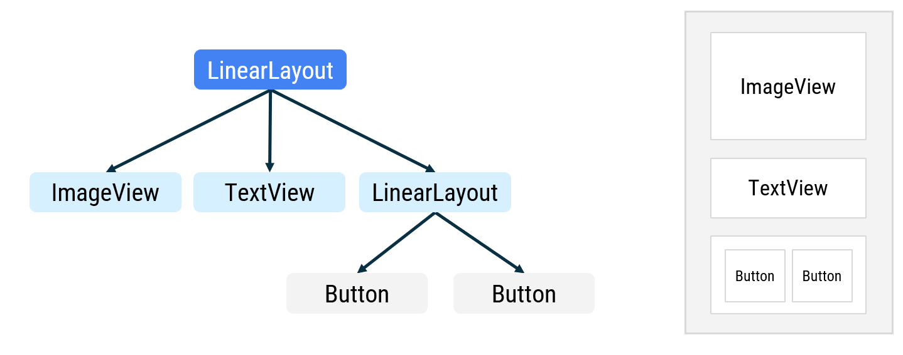

# Ползовательский интерфейс (первое Activity)
При создании первого приложения, вы могли увидеть интерфейс работы с **"внешним видом"** вашего Android-приложения. 

По умолчанию, файл `/layout/activity_main.xml` определяет разметку первой `"страницы" (activity)`, которую видит, с которой взаимодействует пользователь.


Рис. 2. Окно макета `Activity`.

Помимо использования `Palette\Политры` для добавления новых виджетов, можно также добавлять новые и менять свойства существующих виджетов (`View`), используя `XML`-редактор.

Листинг 1. `activity_main.xml`
```xml
<?xml version="1.0" encoding="utf-8"?>
<androidx.constraintlayout.widget.ConstraintLayout xmlns:android="http://schemas.android.com/apk/res/android"
    ...
    ...
    tools:context=".MainActivity">

    <TextView
        android:id="@+id/textView2"
        android:layout_width="wrap_content"
        android:layout_height="wrap_content"
        android:text="Hello World!"
        app:layout_constraintBottom_toBottomOf="parent"
        app:layout_constraintEnd_toEndOf="parent" />

    <Button
        android:id="@+id/go_to_second_activity"
        android:layout_width="wrap_content"
        android:layout_height="wrap_content"
        android:text="SecondActivity"/>

</androidx.constraintlayout.widget.ConstraintLayout>
```

Макет `Activity`, по умолчанию, определяет два виджета (`widgets`): 
- ConstraintLayout;
- TextView;
- p.s. Button (из примера выше) мы добавили **после** создания первого приложения.


Виджеты представляют собой структурные элементы пользовательского интерфейса. Существую различные виджеты по своим функциям\свойствам: вывод текста на экран, ввод текста, нажатие кнопки и другие взаимодействия с пользователем. В примере выше `Button`, `TextView` - это лишь разновидности виджетов.

## Размеры виджетов


Рис.3. Пример `TextView`. 

В Android есть несколько способов задать **размеры** виджета по **высоте** и **ширине** на экране.

1. `wrap_content` - использует только необходимое количество "места" относительно содержимого внутри виджета. Допустим, если хотим использовать размер `View` только на **размер текста** внутри него;
2. `match_parent` - наследует значение родительского виджета\группы виджетов;
3. `Fixed value` (**db** - `density-independent pixel`) - фиксированное значение **почти в пикселях**.

```xml
android:layout_width="wrap_content" 
android:layout_width="match_parent"
android:layout_width="48dp"
```

## ViewGroups

`ViewGroup` - это некий контейнер, в котором распологаются все элементы экрана (`TextView`, `Buttons`, `Scroll`, `ImageView`, `Fragment`, и т.д.). 


Рис. 4. Виды `ViewGroup`.

Если необходимо отобразить несколько элементов на экране, используйте `ViewGroup`. `ViewGroup` также контролирует как будут располагаться виджеты внутри контейнера.

Является родительским (`parent`) для всех виджетов внутри, а сами виджеты называются дочерними (`child`).

1. `FrameLayout` - если хотите использовать только один виджет внутри контейнера (часто используется для **Всплывающих окон**); 
2. `LinearLayout` - складывает виджеты один за другим в колону по **горизонтали** или по **вертикали**; 
3. `ConstraintLayout` - более "свободный" вид помпановки, можно создавать сложные интерфейсы. Android - рекомендует именно его к использованию. 

**FrameLayout**


Рис. 5. Пример `FrameLayout`.


**LinearLayout**


 Рис. 6. Пример `LinearLayout`.

 ## Иерархия виджетов

 Помимо просто виджетов (`Views`) `ViewGroup` также может содержать в себе другие `ViewGroup`. Это создает некую иерархию виджетов, которые зависят от родительского `ViewGroup`.
 

 

 Рис. 7. Пример отображения иерархии виджетов. 


## Идентификаторы виджетов

Каждый элемент `res` - ресурсов Android имеет свой уникальный `resource ID` для доступа к элементу.

## Класс Activity

