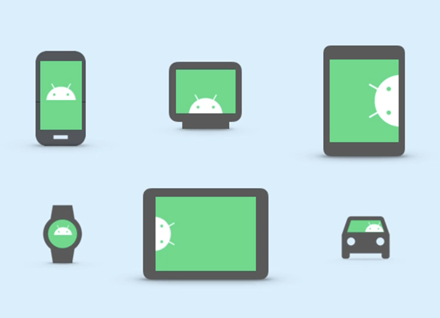
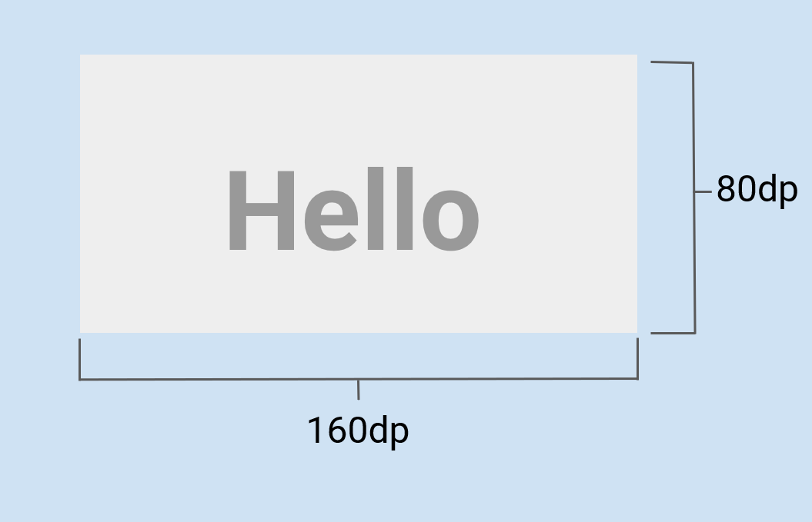
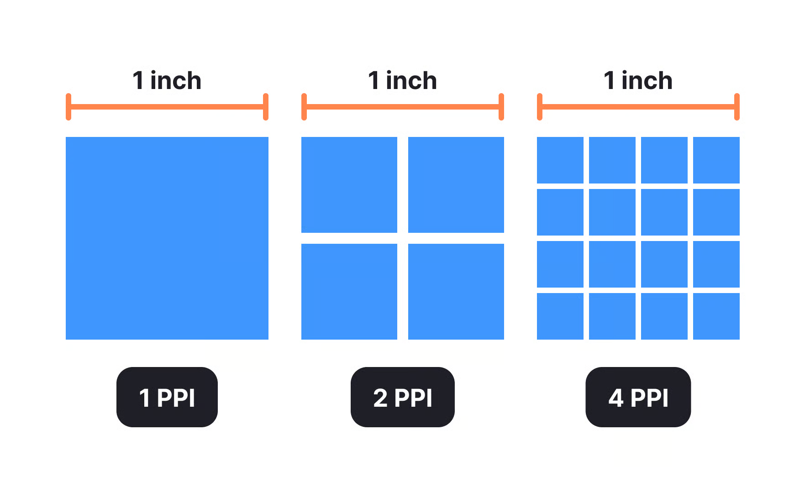

# Макеты элементов пользовательского интерфейса (Layout)

Одной из проблем при разработки приложения является адаптация элементов экрана (пользовательского интерфейса) под устройства с разными характеристиками экранов. 



Рис. 1. Различные размеры экранов устройств Android.

## Density-independent pixel (dp)

Относительный параметр (**не зависящий от плотности экрана пиксель**) был введен во избежании проблем с компановкой элементов внутри разного размера экранов пользовательского оборудования.



Рис. 2. Размеры ширины и высоты `TextView` в `dp`.

Данный параметр учитывает плотность пикселей (`Pixel per Inch` - `PPI`) экрана или `screen density`.
Все Android-виджеты измеряются в относительных величинах (`dp`). 

$$
\int_0^\infty e^{-x^2} dx = \frac{\sqrt{\pi}}{2}
$$

Alternatively, using the math directive:
````{math}
a^2 + b^2 = c^2
````



Рис. 3. Наглядный пример отображения плотности пикселей (`PPI`).