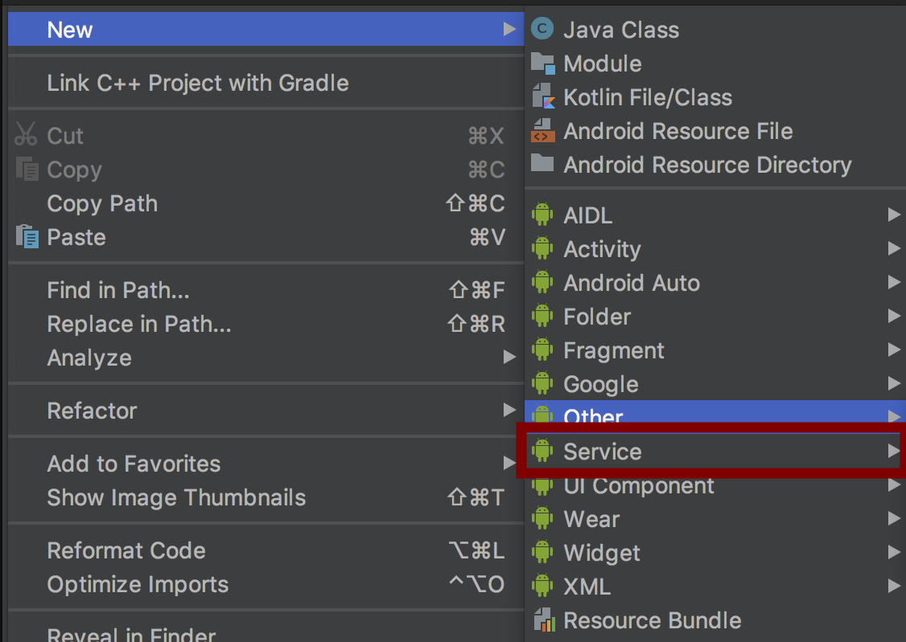

# Запуск задачи в фоновом режиме (Background)

Пример реализации можно посмотреть:
1. [BackgroundService](https://github.com/TelecomDep/android_notes/blob/master/Examples/android_notes/app/src/main/java/com/example/android_notes/services/BackgroundService.kt )
2. [Activity](https://github.com/TelecomDep/android_notes/blob/master/Examples/android_notes/app/src/main/java/com/example/android_notes/activities/ServiceActivity.kt)

# Service
[Service](https://developer.android.com/reference/android/app/Service) — это компонент приложения, который может выполнять длительные операции в фоновом режиме. Он не предоставляет пользовательский интерфейс. После запуска служба может продолжать работу в течение некоторого времени, даже после того, как пользователь переключится на другое приложение. Кроме того, компонент может привязываться к службе для взаимодействия с ней и даже выполнения межпроцессного взаимодействия (IPC). Например, служба может обрабатывать сетевые транзакции, воспроизводить музыку, выполнять файловый ввод-вывод или взаимодействовать с поставщиком контента — и все это в фоновом режиме.

Создание класса сервиса осуществляется след. образом:


Далее, `Android Studio` создас новый класс (назовете его сами в открывшемся окне):

```kotlin
class BackgroundService : Service() {


    override fun onBind(intent: Intent): IBinder {
        TODO("Return the communication channel to the service.")
    }

}
```
Также, добавится поле в `AndroidManifest`-файле:
```xml
    <service
        android:name=".services.BackgroundService"
        android:enabled="true"
        android:exported="true"></service>
```
Класс `Service` является базовым классом для всех сервисов. При расширении этого класса важно создать новый поток, в котором служба сможет выполнить всю свою работу; служба по умолчанию использует основной поток вашего приложения, что может замедлить производительность любого действия, выполняемого вашим приложением.

## Запуск сервиса

**Запущенная служба** — это служба, которую другой компонент запускает путем вызова `startService()` , что приводит к вызову метода `onStartCommand()` службы.

Когда служба запускается, ее жизненный цикл не зависит от компонента, который ее запустил. Служба может работать в фоновом режиме неограниченное время, даже если компонент, запустивший ее, уничтожен. Таким образом, служба должна остановить себя после завершения своей работы, вызвав `stopSelf()` , или другой компонент может остановить ее, вызвав `stopService() `.

Компонент приложения, такой как активность, может запустить службу, вызвав `startService()` и передав Intent , который определяет службу и включает любые данные, которые служба может использовать. Служба получает это Intent в методе `onStartCommand()`.

Добавляем запуск и остановку сервиса:

```kotlin
class BackgroundService : Service() {

    val LOG_TAG: String = "BG_SERVICE"

    override fun onBind(intent: Intent): IBinder {
        TODO("Return the communication channel to the service.")
    }

    override fun onStartCommand(intent: Intent, flags: Int, startId: Int): Int {

        for (i in 0 until 1000) {
                Log.d(LOG_TAG, "Task running: $i")
        }

        return START_STICKY
    }

    override fun onDestroy() {
        super.onDestroy()
        Log.d(LOG_TAG, "Service destroyed")
    }
}
```

Добавляем запуск и остановку сервиса из `Activity` при помощи `Intent`:
```kotlin
    private lateinit var bStart : Button
    private lateinit var bStop : Button
    ...
    ...
    bStart.setOnClickListener({
            val startBgIntend = Intent(this, BackgroundService::class.java)
            startService(startBgIntend)
    });

    bStop.setOnClickListener({
            val stopBgIntend = Intent(this, BackgroundService::class.java)
            stopService(stopBgIntend)
        });
```

В даной реализации нюанс заключается в том, что операционная система Android остановит ваш сервис, если мы свернем приложение или переключимся на другое.

### Оборачиваем выполнение задачи в Корутины

Про корпутины почитать можно [здесь](https://metanit.com/kotlin/tutorial/8.1.php).

Реализация с корутинами:
```kotlin
class BackgroundService : Service() {

    val LOG_TAG: String = "BG_SERVICE"
    private val serviceJob = Job()
    private val serviceScope = CoroutineScope(Dispatchers.IO + serviceJob)


    override fun onBind(intent: Intent): IBinder {
        TODO("Return the communication channel to the service.")
    }


    override fun onStartCommand(intent: Intent, flags: Int, startId: Int): Int {
        serviceScope.launch {
            // Здесь тяжелая задача
            // 1. Обновляем Location, CellInfo
            // 2. Передаем через сокеты данные на backend-сервер
            for (i in 0 until 1000) {
                delay(1000)
                Log.d(LOG_TAG, "Task running: $i")
            }
            stopSelf()
        }
        return START_STICKY
    }

    override fun onDestroy() {
        super.onDestroy()
        serviceJob.cancel()
        Log.d(LOG_TAG, "Service destroyed")
    }
}
```

### Передача данных из Service в Activity

#### Broadcast Receiver

Для примера мы будем использовать `BroadcastRceiver`-класс. Важно отметить, что фильтрация сообщений `Intent` осуществляется по ключевому слову: `IntentFilter("BackGroundUpdate")`, можно добавить любое свое.

`Activity.kt`
```kotlin
class ServiceActivity : AppCompatActivity() {

    private lateinit var bStart : Button
    private lateinit var bStop : Button
    private lateinit var tvTextFromBg : TextView
    lateinit var dataToUi : String
    private val mMessageReceiver: BroadcastReceiver = object : BroadcastReceiver() {
        override fun onReceive(context: Context?, intent: Intent) {
            val message = intent.getStringExtra("Status")
            // Здесь мы получаем данные от Serivce 
            // Кладем в переменную message
            // Делаем с ней что хотим
            tvTextFromBg.setText(message) // Выводим на экран
        }
    }

    override fun onCreate(savedInstanceState: Bundle?) {
        super.onCreate(savedInstanceState)
        enableEdgeToEdge()
        setContentView(R.layout.activity_service)
        ViewCompat.setOnApplyWindowInsetsListener(findViewById(R.id.main)) { v, insets ->
            val systemBars = insets.getInsets(WindowInsetsCompat.Type.systemBars())
            v.setPadding(systemBars.left, systemBars.top, systemBars.right, systemBars.bottom)
            insets
        }

        // Регистрация приемника
        LocalBroadcastManager.getInstance(applicationContext).registerReceiver(
            mMessageReceiver, IntentFilter("BackGroundUpdate"));

    }
```

На стороне `Service` мы отправляем сообщение (message):
```kotlin
class BackgroundService : Service() {

    val LOG_TAG: String = "BG_SERVICE"
    private val serviceJob = Job()
    private val serviceScope = CoroutineScope(Dispatchers.IO + serviceJob)

    override fun onBind(intent: Intent): IBinder {
        TODO("Return the communication channel to the service.")
    }

    // Функция отправки сообщения посредством Intent
    private fun sendMessageToActivity(msg: String?) {
        val intent = Intent("BackGroundUpdate")
        intent.putExtra("Status", msg)
        LocalBroadcastManager.getInstance(this).sendBroadcast(intent)
    }
    override fun onStartCommand(intent: Intent, flags: Int, startId: Int): Int {
        serviceScope.launch {
            for (i in 0 until 1000) {
                delay(1000)
                // Здесь отсылаем сообщение
                sendMessageToActivity("Task running: $i")
                Log.d(LOG_TAG, "Task running: $i")
            }
            stopSelf()
        }
        return START_STICKY
    }

    override fun onDestroy() {
        super.onDestroy()
        serviceJob.cancel()
        Log.d(LOG_TAG, "Service destroyed")
    }
}
```

<!-- ## Bound Serivce
[Bound Service](https://developer.android.com/develop/background-work/services/bound-services) – это взаимодействие по принципу “клиент-сервер”, которое позволяет компоненту приложения, например Activity, подключиться к Service и отправлять запросы через вызовы методов, а не коммуникацией с помощью Intent. Основное предназначение этого формата Service – обеспечение взаимодействия между приложениями, которые работают в разных процессах, но это необязательно. Фактически Inter Process Communication или сокращенно IPC – основная цель, с которой создавали Bound Service.
(https://habr.com/ru/articles/773228/)(c) -->