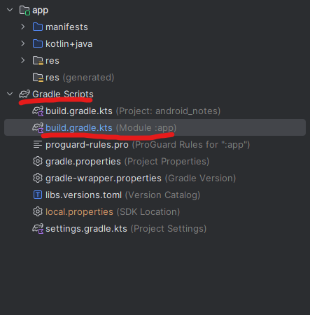

# 7. Библиотека Zero MQ (Android)

### Основы ZMQ
Библиотека [ZeroMQ](https://zeromq.org/get-started/) поддерживает множество языков программирвоания (при помощи `bind'ов`): СИ, С++, Java, Python, Rust и т.д. (по ссылке можно найти полный список).


### Немного потоки в Android (Thread)
**Многопоточность** — возможность программы выполнять несколько задач одновременно в рамках одного процесса.
Применение фоновых потоков — необходимое условие, если вы хотите избежать появления диалогового окна для принудительного закрытия приложения. Когда активность в Android на протяжении 5 секунд не отвечает на события пользовательского ввода (например, нажатие кнопки) или приёмник широковещательных `намерений (Intents)` не завершает работу обработчика `onReceive()` в течение 10 секунд, считается, что приложение зависло. Подобные ситуации следует избегать любой ценой. Используйте фоновые потоки для всех трудоёмких операций, включая **работу с файлами**, **сетевые запросы**, транзакции в базах данных и сложные вычисления.
**Потоки** — средство, которое помогает организовать одновременное выполнение нескольких задач, каждой в независимом потоке. Потоки представляют собой экземпляры классов, каждый из которых запускается и функционирует самостоятельно, автономно (или относительно автономно) от главного потока выполнения программы.

Проблема классических Thread в невозможности получить доступ к объектам\обработчикам основного **графического потока** (`UI thread`). Существует пара [правил](https://developer.android.com/guide/components/processes-and-threads) по работе с потоками:
1. **НЕ** блокировать основной поток;
2. **НЕ** пытайтесь получить доступ к `Android UI Tooklit` вне `UI Thread`.

**Android** предоставляет несколько вариантов работы в **фоновом режиме** безопасно с UI-потоком:
1. Activity.runOnUiThread(Runnable) 
2. View.post(Runnable)
3. View.postDelayed(Runnable, long)
4. **Handlers** - начнем с с этого
5. AsyncTask

Пример с `View.post(Runnable)`:
```kotlin
fun onClick(v: View) {
    Thread(Runnable {
        //DO something
        while(1){
            println("Hello World!")
        }
    }).start()
}
```

#### Жизненный цикл потока
При выполнении программы объект класса `Thread` может быть в одном из четырех основных состояний: **«новый»**, **«работоспособный»**, **«неработоспособный»** и **«пассивный»**. При создании потока он получает состояние «новый» (`NEW`) и не выполняется. Для перевода потока из состояния «новый» в состояние «работоспособный» (`RUNNABLE`) следует выполнить метод `start()`, который вызывает метод `run()` — основной метод потока.

Поток может находиться в одном из состояний, соответствующих элементам статически вложенного перечисления `Thread.State`:

- `NEW` — поток создан, но еще не запущен;
- `RUNNABLE` — поток выполняется;
- `BLOCKED` — поток блокирован;
- `WAITING` — поток ждет окончания работы другого потока;
- `TIMED_WAITING` — поток некоторое время ждет окончания другого потока;
- `TERMINATED` — поток завершен.

#### Инициализация потока 

```kotlin

fun sayHello() {
    for (i in 0..10){
        println("Hello World!")
    }
}
val runnableServer = Runnable{sayHello()} 
val threadServer = Thread(runnableServer)
threadServer.start()
```
### Подключение ZMQ (JeroMQ) в проект Android
Для установки библиотеки [JeroMQ](https://zeromq.org/languages/java/) вам понадобится добавить зависимость в файл `Gradle Scripts` `->` `build.gradle.kts (Module :app)` (как показано на рисунке ниже):


<!-- <p align="center">
  
  <figcaption> Путь к файлу сборки проекта Build gradle for Module :app </figcaption>
</p> -->

Добавляем зависимость (`implementation ("org.zeromq:jeromq:0.5.0")` ):
```
dependencies {

    implementation(libs.androidx.core.ktx)
    implementation(libs.androidx.appcompat)
    implementation(libs.material)
    implementation(libs.androidx.activity)
    implementation(libs.androidx.constraintlayout)
    implementation("com.google.android.gms:play-services-location:21.2.0") // -->> Location
    implementation ("org.zeromq:jeromq:0.5.0") // -->> JeroMQ
    testImplementation(libs.junit)
    androidTestImplementation(libs.androidx.junit)
    androidTestImplementation(libs.androidx.espresso.core)
}
```
Далее, `IDE Android Studio` при фиксации новой зависимости предложит вам синхронизировать все зависимости проекта:


<!-- <p align="center">
  
  <figcaption> Синхронизация при изменении Build gradle for Module :app` </figcaption>
</p> -->

**Клиент и Сервер**
Рассмотрим пример работы Клиента и Сервера в одном Acitvity:

