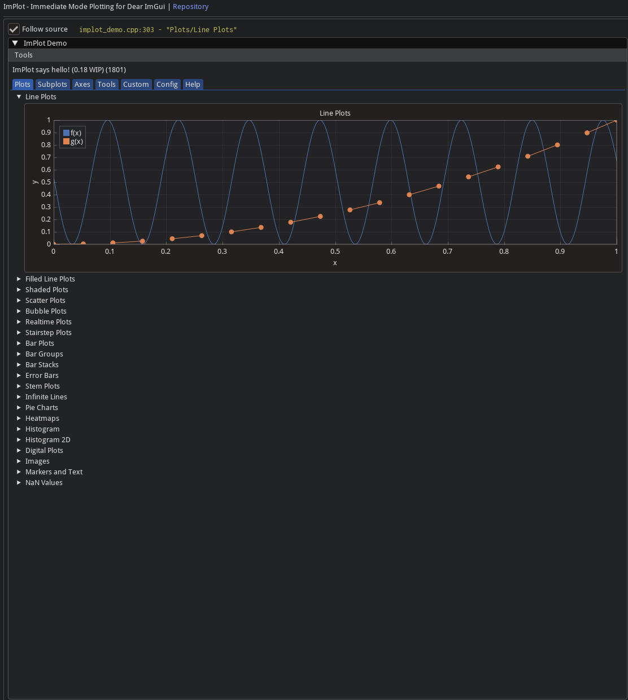
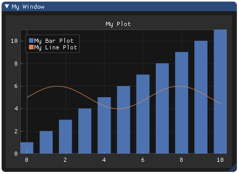

# 4. Работа с графиками


## Установка (подключение к проекту)
В [первой главе](https://telecomdep.github.io/notes/CXX/Imgui/01_introduction.html) мы уже добавили репозитрий [Implot](https://github.com/epezent/implot.git) как сабмодуль в наш проект. Повторим основные шаги для компиляции:

Добавляем в `CmakeLists.txt`
```cmake
# ImPlot
add_library(implot STATIC
    ${THIRD_PARTY_DIR}/implot/implot.cpp
    ${THIRD_PARTY_DIR}/implot/implot_demo.cpp
    ${THIRD_PARTY_DIR}/implot/implot_items.cpp
)
target_include_directories(implot PUBLIC ${THIRD_PARTY_DIR}/implot)
target_link_libraries(implot PRIVATE imgui)
target_compile_options(implot PRIVATE -fPIC)

# Линкуем к main
add_executable(main ${SOURCES})
target_link_libraries(main PRIVATE imgui implot ${SDL2_LIBRARIES} ${OPENGL_LIBRARIES} ${GLEW_LIBRARIES} ${SoapySDR_LIBRARIES} mylib fftw3)
```

## DemoWindow, примеры от разработчиков
**Онлайн версия Демо** - [здесь](https://pthom.github.io/imgui_explorer/?lib=implot).

Как и в основной библиотеке `Dear Imgui`, в данном репозитории присутствует исчерпывающий `demo`-пример:
- Реализации функций можно найти в исполняемом файле `implot_demo.cpp`;
- Вызвать в своем проекте можно при помощи функции `ImPlot::ShowDemoWindow()` (в основном цикле рендеринга вашей программы);
- Рекомендуется использовать этот файл в качестве справочного материала для реализации графиков в своей программе.




## Использование библиотеки
В первую очередь, необходимо инициализировать контекст `ImPlot` (аналогично `ImGui`). Контекст `ImPlot` должен находится внутри контекста `ImGui`: 
```c++
ImGui::CreateContext(); // ImGui контекст
ImPlot::CreateContext(); // Implot контекст
...
ImPlot::DestroyContext();
ImGui::DestroyContext();
```
Инициализируем и уничтожаем контекст при помощи `ImPlot::CreateContext()\ImPlot::DestroyContext()`, где бы вы это ни делали для `ImGuiContext`. 

**API** используется так же, как и любая другая пара `ImGui` `BeginX/EndX`. Сначала инициализируем новое окно с графиком при помощи `ImPlot::BeginPlot()`. Затем **рисуем** столько элементов, сколько хотим, с помощью предусмотренных функций `PlotX` (например, `PlotLine()`, `PlotBars()`, `PlotScatter()` и т. д.). Наконец, закрываем текущее окно с графиком `ImPlot::EndPlot()`.
```c++
int   bar_data[11] = ...;
float x_data[1000] = ...;
float y_data[1000] = ...;

ImGui::Begin("My Window");
if (ImPlot::BeginPlot("My Plot")) {
    ImPlot::PlotBars("My Bar Plot", bar_data, 11);
    ImPlot::PlotLine("My Line Plot", x_data, y_data, 1000);
    ...
    ImPlot::EndPlot();
}
ImGui::End();
```
**Результат**:




