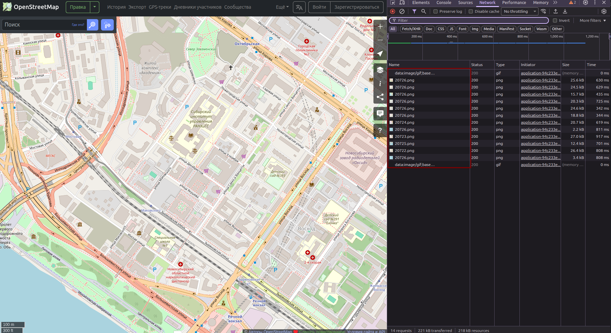
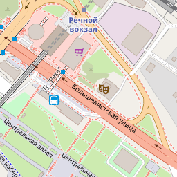
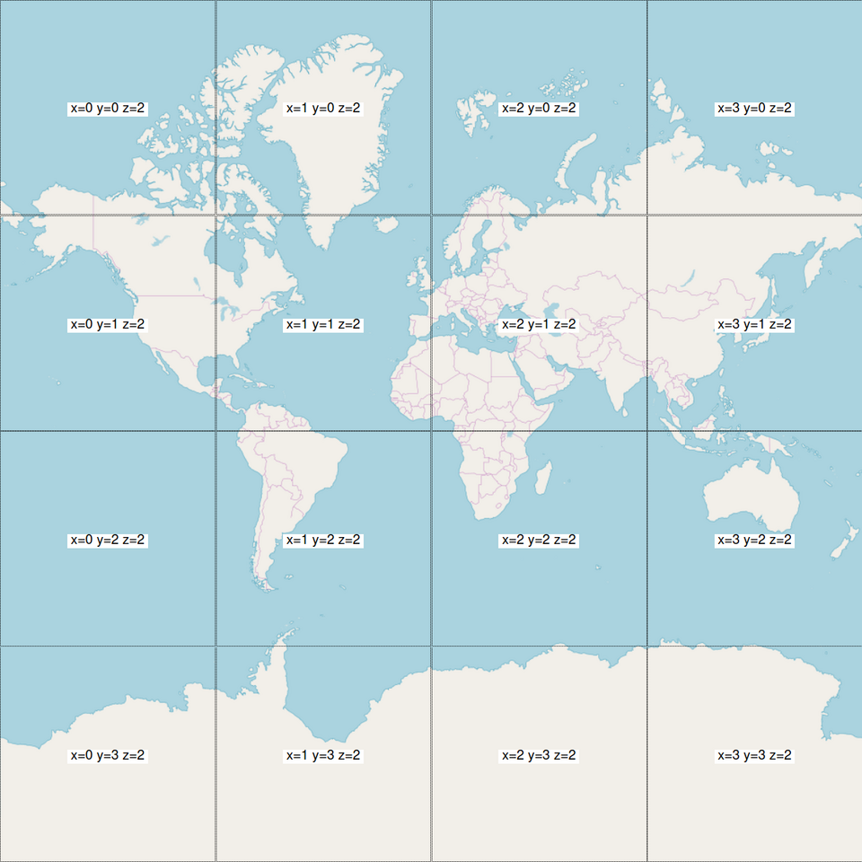

Получение тайлов карты (Open Street Map)
===================================

**Тайлы** - это изображения небольшого размера (одинакового), являющиеся фрагментами большого изображения. В рамках работы с картами - это квадратные (обычно ``256х256`` пикселей, могут быть и ``512x512``) изображения, формирующие карту мира.

Они используются в веб-картографии (``Google Maps``, ``Яндекс Карты``, ``OpenStreetMap``) для быстрой загрузки: браузер загружает только те тайлы, которые видны на экране, экономя трафик и память.

Например, если открыть в браузере карту [OpenStreetMap.org](www.openstreetmap.org), перейти в режим разработчика (``CTRL`` + ``SHIFT`` + ``I``) во вкладке ``Network``, мы увидим следующую картину:

, где увидим, что были загружены несколько изображений ``*.png`` со странными названиями файлов. 

Например, ``20726``:

Этот файл был получен при помощи запроса на сервер ``OpenStreetMap`` - 
``https://tile.openstreetmap.org/16/47867/20726.png``.

`OSM`-карты (и не только они) присваивают каждому изображению свои наименования. Правила наименований описаны в статье:`wiki.openstreetmap.org/wiki/Slippy_map_tilenames <https://wiki.openstreetmap.org/wiki/Slippy_map_tilenames>`_.

Правила наименований тайлов
---------------------

1. Все тайлы имеют размер ``256 × 256`` пикселей формата ``PNG``;
2. Каждое значение масштаба карты (zoom level) является директорией, каждый столбец также является директорией, в которой находятся изображения;
3. Ссылка (``URL``) на получения конкретного файла (``*.png``) формируется в формате: ``/zoom/x/y.png``

Например, для масштаба карты 2 (``zoom = 2``) будут след. наименования:

Можно заметить, что:
- Координата ``Z`` - не меняется, ``Z = 2``. 
- Координаты ``X`` - это **столбцы** матрицы, ``Y`` - **строки** матрицы. 

Тайл серверы
^^^^^^^^^^^^^^^^^^^^^

С названиями координат изображений мы определились, но первая часть URL (например, ``tile.openstreetmap.org``) отвечает за сервер, на который вы или ваше приложение будет отправлять запрос.

.. list-table:: Таблица тайл-серверов
   :widths: 20 15 65
   :header-rows: 1

   * - Name
     - URL template 
     - zoomlevels
   * - OSM 'standard' style
     - https://tile.openstreetmap.org/**zoom/x/y.png**
     - 0-19
   * - OpenCycleMap
     - http://[abc].tile.thunderforest.com/cycle/**zoom/x/y.png**
     - 0-22
   * - Thunderforest Transport
     -http://[abc].tile.thunderforest.com/transport/**zoom/x/y.png**	
     -0-22
   * - MapTiles API Standard
     - https://maptiles.p.rapidapi.com/local/osm/v1/**zoom/x/y.png**?rapidapi-key=YOUR-KEY
     - 0-19 globally
   * - MapTiles API English
     - https://maptiles.p.rapidapi.com/en/map/v1/**zoom/x/y.png**?rapidapi-key=YOUR-KEY
     - 0-19 globally with English labels

.. list-table:: Caption of the table
   :widths: 15 10 30
   :header-rows: 1

   * - Column 1 Header
     - Column 2 Header
     - Column 3 Header
   * - Row 1, Col 1
     - Row 1, Col 2
     - Row 1, Col 3
   * - Row 2, Col 1
     - Row 2, Col 2
     - Row 2, Col 3
Масштаб (zoom levels)
^^^^^^^^^^^^^^^^^^^^^
Ниже приведена таблица по каждому уровню масштабирования (от `0` до `19`). Более подробная таблица находится `здесь <https://wiki.openstreetmap.org/wiki/Zoom_levels>`_.

.. |zoom level |tile coverage	                        |number of tiles	                    | tile size(*) in degrees           |
.. |   ---     |   ---                                 |   ---                                 | ---                               |
.. | 0	        |1 tile covers whole world	            |1 tile                                 |	360° x 170.1022°                |
.. | 1	        |2 × 2 tiles	                        |4 tiles                                |	180° x 85.0511°                 |
.. | 2	        |4 × 4 tiles	                        |16 tiles                               |	90° x [variable]                |
.. | n	        |2n × 2n tiles	|22n tiles                   |	360/2n ° x [variable]|
.. | 12	    |4096 x 4096 tiles	                    |16 777 216	                            | 0.0879° x [variable]              |
.. | 16	    |---	                                |232 ≈ 4 295 million tiles   |	---                             |
.. | 17	    |---	                                |17.2 billion tiles	                    |---                                |
.. | 18	    |---	                                |68.7 billion tiles	                    |---                                |
.. | 19	    |Maximum zoom for Mapnik layer|	274.9 billion tiles	                            |---                                |

Математика
---------------------
.. math::

   (a + b)^2 = a^2 + 2ab + b^2
   e^{i\pi} + 1 = 0

Получение тайлов из кода С\С++
---------------------

