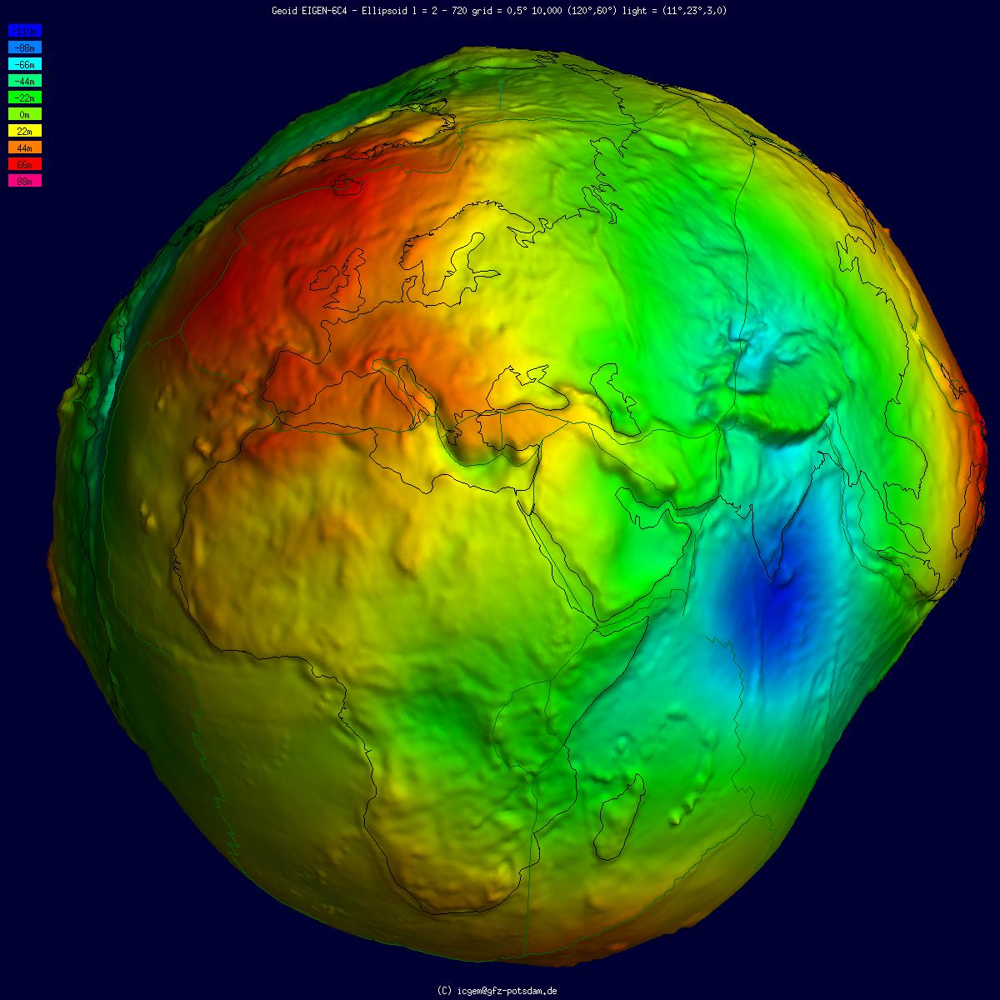
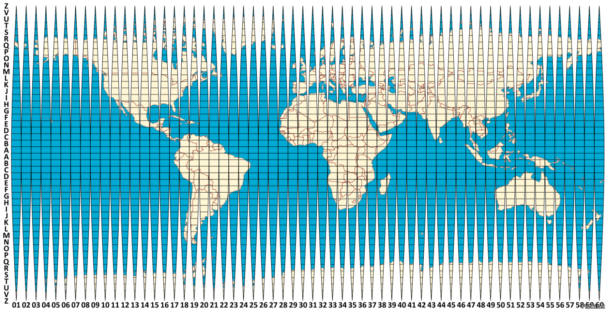
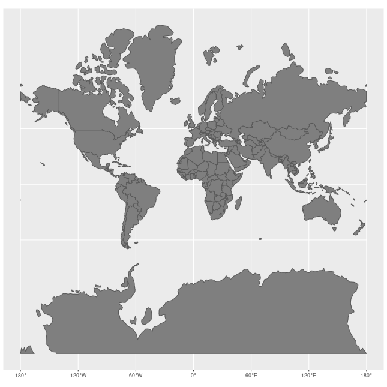
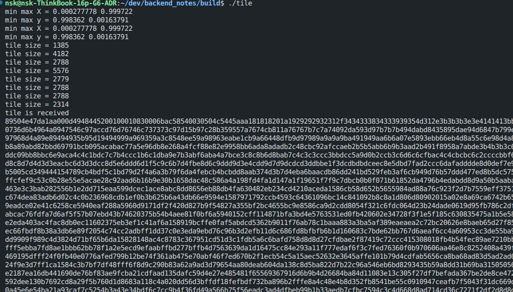

Получение тайлов карты (Open Street Map)
===================================

Данный материал частично основан на информации с источников:

1) Хорошая статья по `ГИС <https://habr.com/ru/companies/bft/articles/773814/>`_;
2) Про `системы координат <https://gis-lab.info/qa/gentle-intro-gis-7.html>`_;
3) И еще про `проекции <https://habr.com/ru/articles/399257/>`_.

Картографические проекции и системы координат
---------------------

Земля имеет форму, так называемого, `геоида <https://ru.wikipedia.org/wiki/%D0%93%D0%B5%D0%BE%D0%B8%D0%B4>`_.  Впервые фигуру геоида описал немецкий математик **К. Ф. Гаусс**, который определял её как `«математическую фигуру Земли» <https://ru.wikipedia.org/wiki/%D0%93%D0%B5%D0%BE%D0%B8%D0%B4>`_ — гладкую, но неправильную поверхность.

   (Авторство: International Centre for Global Earth Models (ICGEM). http://icgem.gfz-potsdam.de/vis3d/longtime / Ince, E. S., Barthelmes, F., Reißland, S., Elger, K., Förste, C., Flechtner, F., Schuh, H. (2019): ICGEM – 15 years of successful collection and distribution of global gravitational models, associated services and future plans. - Earth System Science Data, 11, pp. 647-674,DOI: http://doi.org/10.5194/essd-11-647-2019., CC BY 4.0, https://commons.wikimedia.org/w/index.php?curid=81462823)

Форма геоида обусловлена неравномерным распределением **масс** внутри и на поверхности Земли. Геоид является поверхностью, относительно которой ведётся отсчёт высот над уровнем моря, в силу чего точное знание параметров геоида необходимо, в частности, в навигации — для определения высоты над уровнем моря на основе геодезической (эллипсоидальной) высоты, измеряемой ``GPS``-приёмниками, а также в физической океанологии — для определения высот морской поверхности.

**Проблема геоида в обычной жизни?**

Работать с элипсоидом (аппроксиморованный геоид) напрямую неудобно. Если мы работаем с маленькими масштабами на бумаге, нам потребуется **ОГРОМНЫХ** размеров глобус. И наоборот, при работе с большими масштабами, сложно было бы с таким глобусом охватить взглядом разные материки, например. Для многих задач намного удобнее использовать **плоскую проекцию**.

НО, создать плоскую проекцию Земли без искажений **невозможно** и точка. Не получится преобразовать глобус в плоскость без разрывов (кроме экватора):

   Разрывы при проекции сферы на плоскость. Источник: https://habr.com/ru/companies/bft/articles/773814/.

Для решений данной пробелемы существуют проекции сферы на плоскость, например, проекция **Меркатора**.

Проекция Меркатора
'''''''''''''

Проекция **Меркатора** является лишь одной из большого списка. Список некоторых проекций можно посмотреть `здесь <https://ru.wikipedia.org/wiki/%D0%A1%D0%BF%D0%B8%D1%81%D0%BE%D0%BA_%D0%BA%D0%B0%D1%80%D1%82%D0%BE%D0%B3%D1%80%D0%B0%D1%84%D0%B8%D1%87%D0%B5%D1%81%D0%BA%D0%B8%D1%85_%D0%BF%D1%80%D0%BE%D0%B5%D0%BA%D1%86%D0%B8%D0%B9>`_.

Это цилиндрическая проекция, которая сохраняет углы и формы объектов (равноугольная), но сильно искажает площади ближе к полюсам. Основные области использования — морская навигация, авиация, веб-карты (``Google Maps``, ``Яндекс.Карты``, ``Open Street Map`` и др.) и крупномасштабные карты приэкваториальных областей. 

   Пример искажений в проекции Меркатора. Авторство: Jakub Nowosad. Собственная работа, CC BY-SA 4.0, https://commons.wikimedia.org/w/index.php?curid=73955926 

Про **стандарты**:

- ``EPSG:4326`` — географическая система координат, основанная на системе параметров ``WGS84`` ((`World Geodetic System 1984 <https://en.wikipedia.org/wiki/World_Geodetic_System#WGS84>`_) традиционно использует порядок **широта** — **долгота**, а ``EPSG 4326`` —  **долгота** — **широта**.). Единица измерения — **градус**;

- ``EPSG:3857`` — прямоугольная система координат, основанная на проекции **Меркатора**, построенной по системе параметров ``WGS84``. Единица измерения – **метр**.

Что такое тайлы?
---------------------
**Тайлы** - это изображения небольшого размера (одинакового), являющиеся фрагментами большого изображения. В рамках работы с картами - это квадратные (обычно ``256х256`` пикселей, могут быть и ``512x512``) изображения, формирующие карту мира.

Они используются в веб-картографии (``Google Maps``, ``Яндекс Карты``, ``OpenStreetMap``) для быстрой загрузки: браузер загружает только те тайлы, которые видны на экране, экономя трафик и память.

Например, если открыть в браузере карту [OpenStreetMap.org](www.openstreetmap.org), перейти в режим разработчика (``CTRL`` + ``SHIFT`` + ``I``) во вкладке ``Network``, мы увидим следующую картину:

.. figure:: ./image/imgui_osm_tiles.png
   :width: 100%

   Как web-карта (Open Street Map) получает изображения (тайлы) 

, где увидим, что были загружены несколько изображений ``*.png`` со странными названиями файлов. 

Например, ``20726``:

.. figure:: ./image/20726.png

   https://tile.openstreetmap.org/16/47867/20726.png

Этот файл был получен при помощи запроса на сервер ``OpenStreetMap`` - 
``https://tile.openstreetmap.org/16/47867/20726.png``.

`OSM`-карты (и не только они) присваивают каждому изображению свои наименования. Правила наименований описаны в статье:`wiki.openstreetmap.org/wiki/Slippy_map_tilenames <https://wiki.openstreetmap.org/wiki/Slippy_map_tilenames>`_.

Правила наименований тайлов
'''''''''''''

1. Все тайлы имеют размер ``256 × 256`` пикселей формата ``PNG``;
2. Каждое значение масштаба карты (zoom level) является директорией, каждый столбец также является директорией, в которой находятся изображения;
3. Ссылка (``URL``) на получения конкретного файла (``*.png``) формируется в формате: ``/zoom/x/y.png``

Например, для масштаба карты 2 (``zoom = 2``) будут след. наименования:

.. figure:: ./image/Tiled_web_map_numbering.png
   :width: 80%

   Пример нумерации тайлов

Можно заметить, что:

- Координата ``Z`` - не меняется, ``Z = 2``. 
- Координаты ``X`` - это **столбцы** матрицы, ``Y`` - **строки** матрицы. 

Тайл серверы
'''''''''''''

С названиями координат изображений мы определились, но первая часть URL (например, ``tile.openstreetmap.org``) отвечает за сервер, на который вы или ваше приложение будет отправлять запрос.

.. list-table:: Таблица тайл-серверов
   :widths: 20 65 25
   :header-rows: 1

   * - Name
     - URL template 
     - zoomlevels
   * - OSM 'standard' style
     - https://tile.openstreetmap.org/**zoom/x/y.png**
     - 0-19
   * - OpenCycleMap
     - http://[abc].tile.thunderforest.com/cycle/**zoom/x/y.png**
     - 0-22
   * - Thunderforest Transport
     - http://[abc].tile.thunderforest.com/transport/**zoom/x/y.png**	
     - 0-22
   * - MapTiles API Standard
     - https://maptiles.p.rapidapi.com/local/osm/v1/**zoom/x/y.png**?rapidapi-key=YOUR-KEY
     - 0-19 globally
   * - MapTiles API English
     - https://maptiles.p.rapidapi.com/en/map/v1/**zoom/x/y.png**?rapidapi-key=YOUR-KEY
     - 0-19 globally with English labels

Масштаб (zoom levels)
'''''''''''''
Ниже приведена таблица по каждому уровню масштабирования (от `0` до `19`). Более подробная таблица находится `здесь <https://wiki.openstreetmap.org/wiki/Zoom_levels>`_.

.. _my-zoom-info-table:

.. list-table:: Информация по тайлам для масштабов (0 - 19)
   :widths: 15 10 30 10
   :header-rows: 1

   * - zoom level
     - tile coverage	
     - number of tiles
     - tile size(*) in degrees
   * - 0
     - 1 tile covers whole world
     - 1 tile 
     - 360° x 170.1022° 
   * - 1
     - 2 × 2 tiles
     - 4 tiles
     - 180° x 85.0511° 
   * - 2
     - 4 × 4 tiles	
     - 16 tiles
     - 90° x [variable]
   * - n
     - :math:`2^n × 2^n` tiles
     - :math:`2^{2n}` tiles
     - 360/2n ° x [variable]
   * - 12
     - 4096 x 4096 tiles	
     - 16 777 216
     - 0.0879° x [variable] 
   * - 16
     - ...
     - :math:`2^{32}` ≈ 4 295 million tiles
     - ...
   * - 17
     - ...
     - 17.2 billion tiles
     - ...
   * - 18
     - ...
     - 68.7 billion tiles	 
     - ...
   * - 19
     - Maximum zoom for Mapnik layer
     - 274.9 billion tiles	
     - ...

Получение наименований тайлов
'''''''''''''

Вспомним про странные названия изображений, которые получает наш браузер: ``20726.png``. 

.. figure:: ./image/20726.png

   https://tile.openstreetmap.org/16/47867/20726.png

Если посмотрим на полный путь до этого файла, то увидим: ``16/47867/20726.png``, где:

- ``16`` - zoom;
- ``47867`` - это номер столбца (координата ``X``) во всей матрице тайлов для текущего масштаба;
- ``20726`` - это номер строки (или координата ``Y``) в матрице.

**Наша цель**
.............

Преобразовать GPS-координаты в позиции (``X``, ``Y``) тайлов `Меркатора <https://ru.wikipedia.org/wiki/%D0%9F%D1%80%D0%BE%D0%B5%D0%BA%D1%86%D0%B8%D1%8F_%D0%9C%D0%B5%D1%80%D0%BA%D0%B0%D1%82%D0%BE%D1%80%D0%B0>`_. 

Состоит из 4 этапов:

- Преобразовать углы ``Latitude``, ``Longitude`` в сферическую проекцию Меркатора (из EPSG:4326 в EPSG:3857) `https://epsg.io/3857 <https://epsg.io/3857>`_;
- Преобразовать значения ``X``, ``Y`` к отрезку ``[0 - 1]``, получая относительный квадрат;
- Получить количество всей тайлов для текущего масштаба (``zoom``);
- Умножаем ``X`` и ``Y`` на количество тайлов - получаем "**имена**" тайлов в формате ``zoom/x/y``.

Математика
.............

1) Преобразование в Web-проекцию Меркатора (из ``Lat, Lon`` в ``X, Y``):

.. math::
  :label: (1)

   X_{EPSG:3857} = lon_{EPSG:4326}

, где :math:`lon_{EPSG:4326}` - **longitude** в системе EPSG:4326, :math:`X_{EPSG:3857}` - **X** в системе Меркатора.

.. math::
  :label: (2)

   Y_{EPSG:3857} = \ln(\tan(lat_{EPSG:4326}) + \frac{1}{\cos(lat_{EPSG:4326})})

, где :math:`lat_{EPSG:4326}` - **latitude** в системе EPSG:4326, :math:`Y_{EPSG:3857}` - **Y** в системе Меркатора.

2) Нормируем к интервалу ``(0, 1)``

.. math::
  :label: (3)

   x = 0.5 + \frac{X_{EPSG:3857}}{360}

.. math::
  :label: (4)

   y = 0.5 - \frac{Y_{EPSG:3857}}{2 * \pi}

3) Считаем количество тайлов, которое есть на карте данного масштаба (см. :ref:`my-zoom-info-table`):
 
.. math::
  :label: (5)

   N_{tiles} = 2^{zoom}

, где :math:`N_{tiles}` - количество тайлов, :math:`zoom` - уровень масштабирования.

4) Получаем значения координат тайла (в матрице всех тайлов для :math:`2^{zoom}`)

.. math::
  :label: (6)
  
  x_{tile} = N_{tiles} * x

.. math::
  :label: (7)
  
  y_{tile} = N_{tiles} * y

**Пример**:

Возьмем координаты ``lat = 55.007969``, ``lon = 82.944546`` (широта, долгота), ``zoom = 16``.

.. list-table:: Пример вычисления наименования тайла
   :widths: 10 15 
   :header-rows: 1

   * - Этап
     - Значения
   * - Web-Меркатор
     - | ``lat = 55.007969``
       | ``lon = 82.944546``
       | :math:`X_{EPSG:3857} = 82.944546`
       | :math:`Y_{EPSG:3857} = 1.1544770655`
   * - Нормирование
     - | :math:`x = 0.73040151666`
       | :math:`y = 0.31625926833`
   * - Масштаб
     - :math:`2^{16} = 65536`
   * - Точные индексы тайла по ``X``, ``Y``
     - | :math:`x_{tile} = 0.73040151666 * 65536 = 47867.5937958`
       | :math:`y_{tile} = 0.31625926833 * 65536 = 20726.3674093`
       | :math:`fractional_{x} =59.37958` %
       | :math:`fractional_{y} =36.74093` %;
   * - Значения пикселей в картинке ``256x256``
     - | X - :math:`256 * 0.5937 = 151.9872`
       | Y - :math:`256 * 0.3674 = 94.0544`

С округлением вниз получаем: `z = 16`, `x = 47867`, `y = 20726`. Как мы можем заметить, это совпадает с запросом к тайл-серверу OpenStreetmap: ``https://tile.openstreetmap.org/16/47867/20726.png``.

Получение тайлов из кода С / С++
---------------------

Установка зависимостей и подключение к CMakeLists
'''''''''''''

Устанавливаем пакеты:

.. code-block:: bash

  sudo apt install curl libstb-dev

Добавляем в CmakLists нашего проекта (пример с добавлением проект с ImGUI + PSQL):

.. code-block:: cmake

  include(FindPkgConfig)
  pkg_check_modules(STB REQUIRED stb)

  add_executable(tile ${EXAMPLES_DIR}/osm_tiles/tile_catcher.cpp)
  target_link_libraries(tile PRIVATE imgui implot curl ${SDL2_LIBRARIES} ${OPENGL_LIBRARIES} ${GLEW_LIBRARIES} ${STB_LIBRARIES})
  target_include_directories(tile PRIVATE ${STB_INCLUDE_DIRS})

Отправка запроса на тайл-сервер (``curl``)
'''''''''''''

На данном этапе мы уже знаем как, зная ``zoom`` и координаты ``Lat``, ``Lon``, получить необходмые нам значения ``X``, ``Y``.

Формируем и отправляем запрос:

.. code-block:: c

  ...
  #include <curl/curl.h>
  ...

  // Наш callback при получении данных от libcurl
  size_t onPullResponse(void *data, size_t size, size_t nmemb, void *userp) {
    size_t realsize{size * nmemb};
    auto &blob{*static_cast<std::vector<std::byte> *>(userp)};
    auto const *const dataptr{static_cast<std::byte *>(data)};
    blob.insert(blob.cend(), dataptr, dataptr + realsize);
    std::cout << "Bytes received size = " << realsize << std::endl;
    return realsize;
  }

  bool loaded = false;

  int main()
  {

    // 0. Здесь нам нужно из координат Lat, Lon получить координаты X, Y, Z ()
    int z, int x, int y;
    std::vector<std::byte> &blob

    // 1. Инициализируем структуру curl
    CURL *curl{curl_easy_init()};

    // 2. Формируем строку запроса, зная Z, X, Y
    std::ostringstream urlmaker;
    urlmaker << "https://a.tile.openstreetmap.org";
    urlmaker << '/' << z << '/' << x << '/' << y << ".png";

    // 3. Указываем строку (urlmaker) для структуры curl + немного настроект запроса
    curl_easy_setopt(curl, CURLOPT_URL, urlmaker.c_str());
    curl_easy_setopt(curl, CURLOPT_NOPROGRESS, 1L);
    curl_easy_setopt(curl, CURLOPT_USERAGENT, "curl");
    curl_easy_setopt(curl, CURLOPT_TIMEOUT, 1);
    curl_easy_setopt(curl, CURLOPT_CONNECTTIMEOUT, 1);

    // 3.1. Здесь говорим положить результать в массив байтиков blob
    curl_easy_setopt(curl, CURLOPT_WRITEDATA, (void *)&blob);

    // 3.2. При каждом поступлении данны (chunk'ов) вызывается callback, наша функция onPullResponse (функция определена выше)
    curl_easy_setopt(curl, CURLOPT_WRITEFUNCTION, onPullResponse);
  
    // 4. Собственно, выполнение запроса и проверка на его успешность выполнения.
    const bool ok{curl_easy_perform(curl) == CURLE_OK};
    curl_easy_cleanup(curl);
    loaded = true;

    // 5. Здесь уже получили .PNG-байтики, которые нужно отобразить на гарфике
    return 0;
  }

При выполнении данной программы (если мы захотим еще побайтово вывести информацию в консоль), мы получим след. результат :

   Данные, полученные при помощи библиотеки ``curl``

В текстовом виде это будет выглядеть след. образом, нам здесь важно начало байтового массива:

.. code-block:: 

  0x89 0x50 0x4e 0x47 0xd 0xa 0x1a 0xa 0x0 0x0 0x0 0xd 0x49 0x48 0x44 0x52 0x0 0x0 0x1 0x0 0x0 0x0 0x1 0x0 0x8 0x3 0x0 
  0x0 0x0 0x6b 0xac 0x58 0x54 0x0 0x0 0x3 0x0 0x50 0x4c 0x54 0x45 0xc 0xc 0xc 0x10 0x10 0xc 0x1a 0x1a 0x16 0x23 0x24 
  0x1b 0x25 0x25 0x25 0x2d 0x2d 0x23 0x2d 0x2d 0x2d 0x35 0x35 0x29 0x44 0x4c 0x3 0x33 0x33 0x33 0x3e 0x3f 0x30 0x3f 
  0x40 0x31 0x3c 0x3c 0x3c 0x69 0x2d 0x1e 0x54 0x5b 0x13 0x48 0x49 0x37 0x44 0x44 0x44 0x5b 0x63 0x1b 0x4c 0x4c 0x4c 
  0x5f 0x67 0x20 0x59 0x5a 0x45 0x58 0x58 0x58 0x87 0x49 0x38 0x5f 0x60 0x4a 0x6b 0x72 0x2c 0x63 0x64 0x4d 0x60 0x5f 
  0x5e 0x68 0x69 0x55 0x64 0x64 0x63 0x6e 0x70 0x56 0x69 0x68 0x66 0x6e 0x6e 0x6e 0x76 0x78 0x5c 0x6f 0x70 0x6e 0x71 
  0x71 0x71 0x74 0x74 0x6b 0x77 0x78 0x71 0x78 0x77 0x74 0x7a 0x7a 0x75 0x93 0x9d 0x39 0xac 0x6a 0x58 0x7d .........
  ..................................................................................................................

**.PNG** изображения
'''''''''''''

- Почитать про `.PNG можно здесь <https://habr.com/ru/articles/130472/>`_;
- `Официальная документация <https://www.libpng.org/pub/png/spec/1.2/PNG-Rationale.html#R.PNG-file-signature>`_

Вкратце, .png состоит из двух основных частей:

- Подпись ``.png``;
- Чанки (``chunks``) с данными.

.. figure:: ./image/png_signature_chunks.png

   Обобщенный формат PNG-файла

Подпись PNG
.............

Подпись PNG-файла состоит из 8 байт и представляет собой (в hex-записи):

.. code-block:: 
  
   0x89 0x50 0x4e 0x47 0xd 0xa 0x1a 0xa

, где:

.. list-table:: Заголовок PNG-подписи
   :widths: 10 15 
   :header-rows: 1

   * - Значение (hex)
     - Назначение
   * - 0x89
     - Non-ASCII символ. Препятствует распознаванию PNG, как текстового файла.
   * - 0x50 0x4e 0x47
     - PNG в ASCII записи.
   * - 0D 0A
     - CRLF (Carriage-return, Line-feed), DOS-style перевод строки.
   * - 0x1a
     - Останавливает вывод файла в DOS режиме (end-of-file), чтобы вам не вываливалось многокилобайтное изображение в текстовом виде.
   * - 0xa
     - LF, Unix-style перевод строки.

Чанки (chunks) PNG 
.............

Чанки — это блоки данных, из которых состоит файл. Каждый чанк состоит из 4 секций.

.. list-table:: Формат чанков
   :widths: 10 10 10 10 
   :header-rows: 1

   * - Length (длина)
     - Type (тип)
     - Data (данные)
     - CRC
   * - 4 байта
     - 4 байта
     - Length байт
     - 4 байта

, где:

- **Длина** — это числовое значение длины блока данных;
- **Тип** -  представляет собой 4 чувствительных к регистру ``ASCII``-символа;
- **Данные** - собственно, само изображение;
- **CRC** - контрольная сумма для проверки целостности.

Также, важно отметить, что существуют **Критические чанки:**

- ``IHDR`` — заголовок файла, содержит основную информацию о изображении. Обязан быть первым чанком.
- ``PLTE`` — палитра, список цветов.
- ``IDAT`` — содержит, собственно, изображение. Рисунок можно разбить на несколько ``IDAT`` чанков, для потоковой передачи. В каждом файле должен быть хотя бы один - ``IDAT`` чанк.
- ``IEND`` — завершающий чанк, обязан быть последним в файле.

Минимальный PNG-файл выглядит следующим образом:

.. figure:: ./image/png_minimum.png

   Минимальный PNG-файл.

Преобразование **.PNG ** в пиксельную карту (pixel map)
'''''''''''''

Преобразование будет выполнять при помощи библиотеки ``libstb-dev``, которую мы подключили в ``CMakeLists`` в начале.

.. code-block:: c 

  ...
  #include <stb_image.h>
  ...
  int _width{256}, _height{256}, _channels{}; // Размеры изображения
  std::vector<std::byte> _rawBlob;            // То куда мы положили наши байтики PNG
  std::vector<std::byte> _rgbaBlob;           // В этот массив мы запишем значения Пикселей
  GLuint _id{0};

  // Преобразуем PNG в rgba-массив
  void stbLoad() {
    stbi_set_flip_vertically_on_load(false);
    const auto ptr{
        stbi_load_from_memory(reinterpret_cast<stbi_uc const *>(_rawBlob.data()),
                              static_cast<int>(_rawBlob.size()), &_width, &_height,
                              &_channels, STBI_rgb_alpha)};
    if (ptr) {
      const size_t nbytes{size_t(_width * _height * STBI_rgb_alpha)};
      _rgbaBlob.resize(nbytes);
      _rgbaBlob.shrink_to_fit();
      const auto byteptr{reinterpret_cast<std::byte *>(ptr)};
      _rgbaBlob.insert(_rgbaBlob.begin(), byteptr, byteptr + nbytes);
      stbi_image_free(ptr);
    }
  } 

  // Преобразуем в текстуру GL
  void glLoad(){
    glGenTextures(1, &_id);
    glBindTexture(GL_TEXTURE_2D, _id);
    glTexParameteri(GL_TEXTURE_2D, GL_TEXTURE_MIN_FILTER, GL_NEAREST);
    glTexParameteri(GL_TEXTURE_2D, GL_TEXTURE_MAG_FILTER, GL_NEAREST);
    glPixelStorei(GL_UNPACK_ROW_LENGTH, 0);
    glTexImage2D(GL_TEXTURE_2D, 0, GL_RGBA, _width, _height, 0, GL_RGBA,
                GL_UNSIGNED_BYTE, _rgbaBlob.data());
  }

  int main(){

    ...
    while(1){
      ...
      ImPlot::BeginPlot("##ImOsmMapPlot");

      // Параметры для отображения картинки
      ImVec2 _uv0{0, 1};        // Top-left of the texture
      ImVec2 _uv1{1, 0};        // Bottom-right of the texture
      ImVec4 _tint{1, 1, 1, 1}; // Цвет, накладываемый поверх нашего изображения
      ImVec2 bmin{0, 0};
      ImVec2 bmax{256, 256};

      stbLoad();
      glLoad();

      // Отображаем текстуру GL - _id, которую мы создали из RGBa
      ImPlot::PlotImage("##", _id, bmin, bmax, _uv0, _uv1, _tint);

      ImPlot::EndPlot();
      ...
    }
    ...
  }

Если вывести на экран первые несколько значений ``std::vector<std::byte> _rgbaBlob;``, увидим следующее:

.. code-block:: 

  228, 228, 227, 255
  156, 156, 155, 255
  148, 147, 147, 255
  212, 212, 211, 255
  245, 244, 243, 255
  242, 239, 233, 255
  230, 228, 220, 255
  160, 159, 155, 255
  212, 209, 206, 255
  242, 239, 233, 255
  242, 239, 233, 255
  242, 239, 233, 255
  242, 239, 233, 255
  242, 239, 233, 255
  237, 235, 229, 255
  197, 218, 184, 255
  149, 177, 92, 255
  180, 188, 100, 255
  247, 250, 191, 255
  247, 250, 191, 255
  247, 250, 191, 255
  247, 250, 191, 255
  247, 250, 191, 255
  247, 250, 191, 255
  247, 250, 191, 255

**Готово**:

`Полный пример можно найти здесь <https://github.com/TelecomDep/backend_notes/blob/main/examples/osm_tiles/tile_catcher.cpp>`_.

.. figure:: ./image/png_tile_plot.png

   Результат.

.. Преобразования Меркатора на языке СИ
.. '''''''''''''

.. `Пример преобразований <https://wiki.openstreetmap.org/wiki/Mercator>`_ ``Latitude`` и ``Longitude`` в проекцию Меркатора на языке ``СИ``:

.. .. code-block:: c

..     #include <math.h>
..     #define DEG2RAD(a)   ((a) / (180 / M_PI))
..     #define RAD2DEG(a)   ((a) * (180 / M_PI))
..     #define EARTH_RADIUS 6378137

..     /* The following functions take their parameter and return their result in degrees */

..     double y2lat_d(double y)   { return RAD2DEG( atan(exp( DEG2RAD(y) )) * 2 - M_PI/2 ); }
..     double x2lon_d(double x)   { return x; }

..     double lat2y_d(double lat) { return RAD2DEG( log(tan( DEG2RAD(lat) / 2 +  M_PI/4 )) ); }
..     double lon2x_d(double lon) { return lon; }

..     /* The following functions take their parameter in something close to meters, along the equator, and return their result in degrees */

..     double y2lat_m(double y)   { return RAD2DEG(2 * atan(exp( y/EARTH_RADIUS)) - M_PI/2); }
..     double x2lon_m(double x)   { return RAD2DEG(              x/EARTH_RADIUS           ); }

..     /* The following functions take their parameter in degrees, and return their result in something close to meters, along the equator */

..     double lat2y_m(double lat) { return log(tan( DEG2RAD(lat) / 2 + M_PI/4 )) * EARTH_RADIUS; }
..     double lon2x_m(double lon) { return          DEG2RAD(lon)                 * EARTH_RADIUS; }