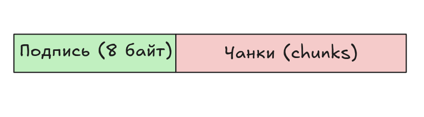
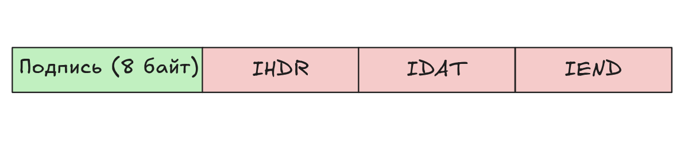
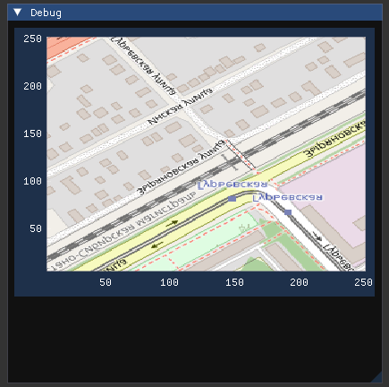

Преобразование изображения в значения пикселей (PNG + STB_IMAGE)
===================================

1) Немного теории про **.PNG** 
---------------------

- Почитать про `.PNG можно здесь <https://habr.com/ru/articles/130472/>`_;
- `Официальная документация <https://www.libpng.org/pub/png/spec/1.2/PNG-Rationale.html#R.PNG-file-signature>`_

Вкратце, .png состоит из двух основных частей:

- Подпись ``.png``;
- Чанки (``chunks``) с данными.

   Обобщенный формат PNG-файла

Подпись PNG
.............

Подпись PNG-файла состоит из 8 байт и представляет собой (в hex-записи):

.. code-block:: 
  
   0x89 0x50 0x4e 0x47 0xd 0xa 0x1a 0xa

, где:

.. list-table:: Заголовок PNG-подписи
   :widths: 10 15 
   :header-rows: 1

   * - Значение (hex)
     - Назначение
   * - 0x89
     - Non-ASCII символ. Препятствует распознаванию PNG, как текстового файла.
   * - 0x50 0x4e 0x47
     - PNG в ASCII записи.
   * - 0D 0A
     - CRLF (Carriage-return, Line-feed), DOS-style перевод строки.
   * - 0x1a
     - Останавливает вывод файла в DOS режиме (end-of-file), чтобы вам не вываливалось многокилобайтное изображение в текстовом виде.
   * - 0xa
     - LF, Unix-style перевод строки.

Чанки (chunks) PNG 
.............

Чанки — это блоки данных, из которых состоит файл. Каждый чанк состоит из 4 секций.

.. list-table:: Формат чанков
   :widths: 10 10 10 10 
   :header-rows: 1

   * - Length (длина)
     - Type (тип)
     - Data (данные)
     - CRC
   * - 4 байта
     - 4 байта
     - Length байт
     - 4 байта

, где:

- **Длина** — это числовое значение длины блока данных;
- **Тип** -  представляет собой 4 чувствительных к регистру ``ASCII``-символа;
- **Данные** - собственно, само изображение;
- **CRC** - контрольная сумма для проверки целостности.

Также, важно отметить, что существуют **Критические чанки:**

- ``IHDR`` — заголовок файла, содержит основную информацию о изображении. Обязан быть первым чанком.
- ``PLTE`` — палитра, список цветов.
- ``IDAT`` — содержит, собственно, изображение. Рисунок можно разбить на несколько ``IDAT`` чанков, для потоковой передачи. В каждом файле должен быть хотя бы один - ``IDAT`` чанк.
- ``IEND`` — завершающий чанк, обязан быть последним в файле.

Минимальный PNG-файл выглядит следующим образом:

   Минимальный PNG-файл.

2) Библиотека STB
---------------------

Баблиотека (на базе ``С``) `STB <https://github.com/nothings/stb>`_ является довольно популярной (``33.2k`` stars on github) библиотекой для чтения изображений формата STB, библиотека состоит из одного заголовочного файла. 

Есть более полный список библиотек для работы с изображениями и не только: `https://habr.com/ru/articles/831754/ <https://habr.com/ru/articles/831754/>`_.

Установка зависимостей и подключение к CMakeLists
'''''''''''''

Устанавливаем пакеты:

.. code-block:: bash

  sudo apt install libstb-dev

Добавляем в CmakLists нашего проекта (где уже подключены ``ImGUI`` + ``PSQL`` + ``curl``):

.. code-block:: cmake

  include(FindPkgConfig)
  pkg_check_modules(STB REQUIRED stb)

  add_executable(tile ${EXAMPLES_DIR}/osm_tiles/tile_catcher.cpp)
  target_link_libraries(tile PRIVATE imgui implot curl ${SDL2_LIBRARIES} ${OPENGL_LIBRARIES} ${GLEW_LIBRARIES} ${STB_LIBRARIES})
  target_include_directories(tile PRIVATE ${STB_INCLUDE_DIRS})

Основные функции
'''''''''''''

.. list-table:: Основные функции
   :widths: 10 20
   :header-rows: 1

   * - Имя
     - Что делает?
   * - ``stbi_load_from_memory``
     - | загрузка изображений из оперативной памяти, а не с диска. 
       | Она принимает указатель на буфер данных, размер, возвращает пиксели и параметры изображения (x, y, channels). 
       | Поддерживает ``JPEG``, ``PNG``, ``TGA``, ``BMP``, ``GIF``, ``HDR`` и др., возвращая ``stbi_uc`` (``unsigned char``).
   * - ``stbi_image_free(void *retval_from_stbi_load)``
     - функция для освобождения памяти, выделенной функциями ``stbi_load`` или ``stbi_load_from_memory``.
   * - ``stbi_info()``
     - позволяет получить информацию об изображении (ширину, высоту, количество компонентов) без полной загрузки пикселей. 

Здесь будут примеры:

Преобразование **.PNG ** в пиксельную карту (pixel map)
'''''''''''''

Преобразование будет выполнять при помощи библиотеки ``libstb-dev``, которую мы подключили в ``CMakeLists`` в начале.

.. code-block:: c 

  ...
  #include <stb_image.h>
  ...
  int _width{256}, _height{256}, _channels{}; // Размеры изображения
  std::vector<std::byte> _rawBlob;            // То куда мы положили наши байтики PNG
  std::vector<std::byte> _rgbaBlob;           // В этот массив мы запишем значения Пикселей
  GLuint _id{0};

  // Преобразуем PNG в rgba-массив
  void stbLoad() {
    stbi_set_flip_vertically_on_load(false);
    const auto ptr{
        stbi_load_from_memory(reinterpret_cast<stbi_uc const *>(_rawBlob.data()),
                              static_cast<int>(_rawBlob.size()), &_width, &_height,
                              &_channels, STBI_rgb_alpha)};
    if (ptr) {
      const size_t nbytes{size_t(_width * _height * STBI_rgb_alpha)};
      _rgbaBlob.resize(nbytes);
      _rgbaBlob.shrink_to_fit();
      const auto byteptr{reinterpret_cast<std::byte *>(ptr)};
      _rgbaBlob.insert(_rgbaBlob.begin(), byteptr, byteptr + nbytes);
      stbi_image_free(ptr);
    }
  } 

  // Преобразуем в текстуру GL
  void glLoad(){
    glGenTextures(1, &_id);
    glBindTexture(GL_TEXTURE_2D, _id);
    glTexParameteri(GL_TEXTURE_2D, GL_TEXTURE_MIN_FILTER, GL_NEAREST);
    glTexParameteri(GL_TEXTURE_2D, GL_TEXTURE_MAG_FILTER, GL_NEAREST);
    glPixelStorei(GL_UNPACK_ROW_LENGTH, 0);
    glTexImage2D(GL_TEXTURE_2D, 0, GL_RGBA, _width, _height, 0, GL_RGBA,
                GL_UNSIGNED_BYTE, _rgbaBlob.data());
  }

  int main(){

    ...
    while(1){
      ...
      ImPlot::BeginPlot("##ImOsmMapPlot");

      // Параметры для отображения картинки
      ImVec2 _uv0{0, 1};        // Top-left of the texture
      ImVec2 _uv1{1, 0};        // Bottom-right of the texture
      ImVec4 _tint{1, 1, 1, 1}; // Цвет, накладываемый поверх нашего изображения
      ImVec2 bmin{0, 0};
      ImVec2 bmax{256, 256};

      stbLoad();
      glLoad();

      // Отображаем текстуру GL - _id, которую мы создали из RGBa
      ImPlot::PlotImage("##", _id, bmin, bmax, _uv0, _uv1, _tint);

      ImPlot::EndPlot();
      ...
    }
    ...
  }

Если вывести на экран первые несколько значений ``std::vector<std::byte> _rgbaBlob;``, увидим следующее:

.. code-block:: 

  228, 228, 227, 255
  156, 156, 155, 255
  148, 147, 147, 255
  212, 212, 211, 255
  245, 244, 243, 255
  242, 239, 233, 255
  230, 228, 220, 255
  160, 159, 155, 255
  212, 209, 206, 255
  242, 239, 233, 255
  242, 239, 233, 255
  242, 239, 233, 255
  242, 239, 233, 255
  242, 239, 233, 255
  237, 235, 229, 255
  197, 218, 184, 255
  149, 177, 92, 255
  180, 188, 100, 255
  247, 250, 191, 255
  247, 250, 191, 255
  247, 250, 191, 255
  247, 250, 191, 255
  247, 250, 191, 255
  247, 250, 191, 255
  247, 250, 191, 255

**Готово**:

`Полный пример можно найти здесь <https://github.com/TelecomDep/backend_notes/blob/main/examples/osm_tiles/tile_catcher.cpp>`_.

   Результат.