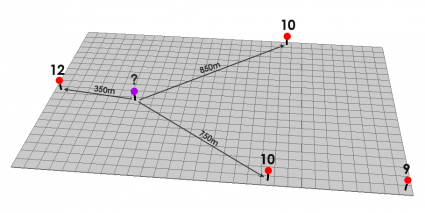
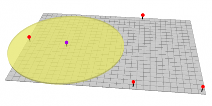

Генерация тепловой карты
===================================

Пространственная интерполяция методом Inverse Distance Weighting (IDW)
---------------------

Метод обратно взвешенных расстояний (Inverse Distance Weighted — IDW) — это детерминированный алгоритм интерполяции, используемый в ГИС для оценки значений в точках с неизвестными данными на основе взвешенного среднего значений известных точек.

В приведенном ниже примере красные точки имеют **известные** значения (экспериментальные в нашем случае). Остальные точки необходимо вычислить для плавного отображения тепловой карты (например для фиолетовой точке). 

   Как найти значение в точках, где нет экспериментальных данных?

   Пример с ограничением радиуса. Источник: https://gisgeography.com/inverse-distance-weighting-idw-interpolation/

.. math::
   :label: (1)

   weight(x) = \left\{ \begin{array}{cl}
   \frac{\sum_{i=1}^{N} w_{i}(x)weight_{i}}{\sum_{i=1}^{N} w_{i}(x)}  & , \text{if } d(x, x_{i}) \neq  0  \\
   weight_{i} & ,  \text{if }d(x, x_{i}) = 0
   \end{array} \right.

, где:

.. math::

   w_{i}(x) = \frac{1}{d(x, x_{i})^{p}}

.. figure:: ./image/heatmap/IDW-Power1-Surface-425x135.png

   Результат интерполяции. Источник: https://gisgeography.com/inverse-distance-weighting-idw-interpolation/

Реализация в коде
---------------------

Для примера возьмем 5 точке на пиксельной карте размером ``256x256`` пикселей (должно быть нам знакомо). 

.. code-block:: c
  
   #include <stb_image.h>
   #include "stb_image_write.h"
   ...
   ...

   float x_pixels[5] = { 10, 40, 100, 120, 200 };
   float y_pixels[5] = {10, 50, 200, 134, 55};
   float value[5] = { 80, 5, 10, 95, 59 };

   int channels = 4; // RGBA
   int h = 256;
   int w = 256;
   std::vector<unsigned char> image(w * h * channels);
   for (int y = 0; y < h; ++y) {
      for (int x = 0; x < w; ++x) {
         int index = (y * w + x) * channels;
         image[index + 0] = 255;    // Red
         image[index + 1] = 0;      // Green
         image[index + 2] = 0;      // Blue
         image[index + 3] = 255;    // Alfa
      }
   }

   // Сохраняем пиксельную карту в формате .png
   stbi_write_png("gradient.png", w, h, channels, image.data(), w * channels);

Результатом будет след. изображение, которое сохраниться в директории ``/build`` вашего проекта.

   Первая пиксельная карта в формате ``.png``.