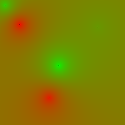

Генерация тепловой карты
===================================

Пространственная интерполяция методом Inverse Distance Weighting (IDW)
---------------------

Метод обратно взвешенных расстояний (Inverse Distance Weighted — IDW) — это детерминированный алгоритм интерполяции, используемый в ГИС для оценки значений в точках с неизвестными данными на основе взвешенного среднего значений известных точек.

В приведенном ниже примере красные точки имеют **известные** значения (экспериментальные в нашем случае). Остальные точки необходимо вычислить для плавного отображения тепловой карты (например для фиолетовой точке). 

.. figure:: ./image/heatmap/IDW-3Points-425x213.png

   Как найти значение в точках, где нет экспериментальных данных?

Можно также указать "радиус поиска" и интерполяция будет работать (использовать для расчета) только нужные нам **известные** точки.

.. figure:: ./image/heatmap/IDW-Buffer-425x213.png

   Пример с ограничением радиуса. Источник: https://gisgeography.com/inverse-distance-weighting-idw-interpolation/

Ниже представлена формула расчета ``IDW``:

.. math::
   :label: (1)

   weight(x) = \left\{ \begin{array}{cl}
   \frac{\sum_{i=1}^{N} w_{i}(x)weight_{i}}{\sum_{i=1}^{N} w_{i}(x)}  & , \text{if } d(x, x_{i}) \neq  0  \\
   weight_{i} & ,  \text{if }d(x, x_{i}) = 0
   \end{array} \right.

, где:

.. math::

   w_{i}(x) = \frac{1}{d(x, x_{i})^{p}}, \\
   d(x, x_{i})^{p} & , \text{ distance between points }

.. figure:: ./image/heatmap/IDW-Power1-Surface-425x135.png

   Результат интерполяции. Источник: https://gisgeography.com/inverse-distance-weighting-idw-interpolation/

Реализация в коде
---------------------

Pixmap (PNG)
.............

Для примера возьмем 5 точек на пиксельной карте размером ``256x256`` пикселей (должно быть нам знакомо). 

.. code-block:: c
  
   #include <stb_image.h>
   #include "stb_image_write.h"
   ...
   ...

   float x_pixels[5] = { 10, 40, 100, 120, 200 };
   float y_pixels[5] = {10, 50, 200, 134, 55};
   float value[5] = { 80, 5, 10, 95, 59 };

   int channels = 4; // RGBA
   int h = 256;
   int w = 256;
   std::vector<unsigned char> image(w * h * channels);
   for (int y = 0; y < h; ++y) {
      for (int x = 0; x < w; ++x) {
         int index = (y * w + x) * channels;
         image[index + 0] = 255;    // Red
         image[index + 1] = 0;      // Green
         image[index + 2] = 0;      // Blue
         image[index + 3] = 255;    // Alfa
      }
   }

   // Сохраняем пиксельную карту в формате .png
   stbi_write_png("gradient.png", w, h, channels, image.data(), w * channels);

Результатом будет след. изображение, которое сохранится в директории ``/build`` вашего проекта.

.. figure:: ./image/heatmap/pix_map_example.png

   Первая пиксельная карта в формате ``.png``.

Градиент
.............

Для примера объявим структуру ``Color``, которая состоит из 3 цветов. Также определим функцию градиентного перехода, которая будет возвращать текущий цвет в зависимости от его интенсивности.

Интенсивность будем определять весовым коэфициентом, который вычисляется по формуле ``(1)``.

.. code-block:: c
  
   struct Color {
    int r, g, b;
   };

   // Calculates the color at a specific 'ratio' (0.0 to 1.0)
   Color gradientColor(Color c1, Color c2, double ratio) {
      return {
         static_cast<int>(c1.r + (c2.r - c1.r) * ratio),
         static_cast<int>(c1.g + (c2.g - c1.g) * ratio),
         static_cast<int>(c1.b + (c2.b - c1.b) * ratio)
      };
   }

Снова пересчитываем пиксельную карту и преобразуем в ``.png``-формат.

.. code-block:: c

   #include <stb_image.h>
   #include "stb_image_write.h"
   ...
   ...

   float x_pixels[5] = { 10, 40, 100, 120, 200 };
   float y_pixels[5] = {10, 50, 200, 134, 55};
   float value[5] = { 80, 5, 10, 95, 59 };

   int channels = 4; // RGBA
   int h = 256;
   int w = 256;
   std::vector<unsigned char> image(w * h * channels);
   for (int y = 0; y < h; ++y) {
      for (int x = 0; x < w; ++x) {

         float weight = XXX; // вес считаем по формуле IDW

         double ratio = (double)weight / (steps - 1);
         Color current = gradientColor(start, end, ratio);
         
         int index = (y * w + x) * channels;
         image[index + 0] = current.r;    // Red gradient
         image[index + 1] = current.g;    // Green gradient
         image[index + 2] = current.b;    // Blue constant
         image[index + 3] = 255;          // Alfa constant
      }
   }

   // Сохраняем пиксельную карту в формате .png
   stbi_write_png("gradient.png", w, h, channels, image.data(), w * channels);

   Реализация градиента.

Примечания к практической работе
.............

В рамках реализации данного вида интерполяции нам потребуются формулы:

1) `формула вычисления дистанции между двумя точками на карте Земли <https://www.movable-type.co.uk/scripts/latlong.html>`_
2) Обратите внимание на нахождение суммы весовых коэфициентов в формуле ``(1)`` и теми параметрами, по которым вы будете строить тепловую карту (могут быть децибелы).