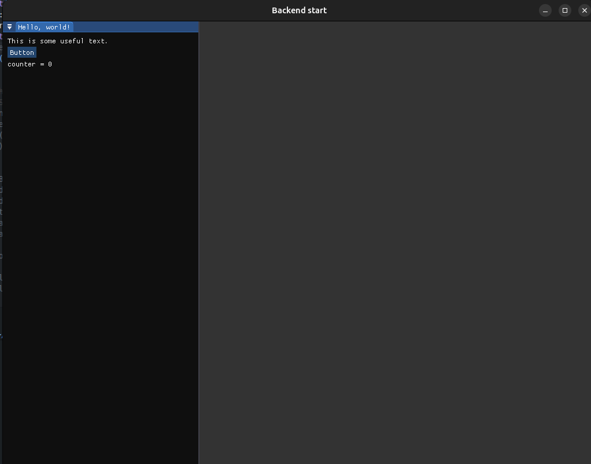
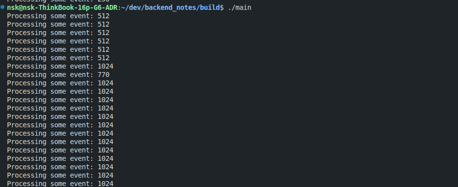

# Первая программа с Dear Imgui

Схематично вся работа нашей программы будет выглядеть следующим образом (см рисунок ниже):


С точки зрения кода программы, то простой интерфейс с одной кнопкой и выводом текста будет выглядеть следующим образом:

```c++
#include <GL/glew.h>
#include <SDL2/SDL.h>

#include <iostream>
#include <chrono>
#include <thread>
#include <cmath>

#include "backends/imgui_impl_opengl3.h"
#include "backends/imgui_impl_sdl2.h"
#include "imgui.h"

int main(int argc, char *argv[]) {

    // 1) Инициализация SDL
    SDL_Init(SDL_INIT_VIDEO | SDL_INIT_TIMER);
    SDL_Window* window = SDL_CreateWindow(
        "Backend start", SDL_WINDOWPOS_CENTERED, SDL_WINDOWPOS_CENTERED,
        1024, 768, SDL_WINDOW_OPENGL | SDL_WINDOW_RESIZABLE);
    SDL_GLContext gl_context = SDL_GL_CreateContext(window);

    // 2) Инициализация контекста Dear Imgui
    ImGui::CreateContext();
    ImPlot::CreateContext();

    // Ввод\вывод
    ImGuiIO& io = ImGui::GetIO(); (void)io;
    io.ConfigFlags |= ImGuiConfigFlags_NavEnableKeyboard;     // Включить Keyboard Controls
    io.ConfigFlags |= ImGuiConfigFlags_NavEnableGamepad;      // Включить Gamepad Controls
    io.ConfigFlags |= ImGuiConfigFlags_DockingEnable;         // Включить Docking

    // 2.1) Привязка Imgui к SDL2 и OpenGl backend'ам
    ImGui_ImplSDL2_InitForOpenGL(window, gl_context);
    ImGui_ImplOpenGL3_Init("#version 330");

    // 3) Игра началась
    bool running = true;
    while (running) {

        // 3.0) Обработка event'ов (inputs, window resize, mouse moving, etc.);
        SDL_Event event;
        while (SDL_PollEvent(&event)) {
            std::cout << "Processing some event: "<< event.type << std::endl;
            ImGui_ImplSDL2_ProcessEvent(&event);
            if (event.type == SDL_QUIT) {
                running = false;
            }
        }

        // 3.1) Начинаем создавать новый фрейм;
        ImGui_ImplOpenGL3_NewFrame();
        ImGui_ImplSDL2_NewFrame();
        ImGui::NewFrame();
        ImGui::DockSpaceOverViewport(0, nullptr, ImGuiDockNodeFlags_None);


        // 3.2) Наш виджет с кнопкой;
        {
            static int counter = 0;
            ImGui::Begin("Hello, world!"); 
                ImGui::Text("This is some useful text.");    
                if (ImGui::Button("Button"))                         
                    counter++;
                ImGui::Text("counter = %d", counter);
            ImGui::End();
        }

        // 3.3) Отправляем на рендер;
        ImGui::Render();
        glClearColor(0.1f, 0.1f, 0.1f, 1.0f);
        glClear(GL_COLOR_BUFFER_BIT);
        ImGui_ImplOpenGL3_RenderDrawData(ImGui::GetDrawData());

        SDL_GL_SwapWindow(window);
    }

    // 4) Закрываем приложение безопасно.
    ImGui_ImplOpenGL3_Shutdown();
    ImGui_ImplSDL2_Shutdown();
    ImPlot::DestroyContext();
    ImGui::DestroyContext();
    SDL_GL_DeleteContext(gl_context);
    SDL_DestroyWindow(window);
    SDL_Quit();

    return 0;
}
```

**Получаем**:


## 1) Окно GUI интерфейса (SDL2)

```c++
SDL_Init(SDL_INIT_VIDEO | SDL_INIT_TIMER);
SDL_Window* window = SDL_CreateWindow(
                    "Backend start", 
                    SDL_WINDOWPOS_CENTERED, 
                    SDL_WINDOWPOS_CENTERED,
                    1024, 768, 
                    SDL_WINDOW_OPENGL | SDL_WINDOW_RESIZABLE);
SDL_GLContext gl_context = SDL_GL_CreateContext(window);
```
- `title` — имя окна.
- `x,y` — координаты окна. Если хотим открыть на весь экран, то нужно ставить 0,0
- `w,h` — размеры окна. Что бы открыть на весть экран обращаемся к объекту displayMode.
- `flags` — тут выставляем флаги инициализации окна.

## 2) Инициализация контекста Dear ImGui

```c++
// Imgui
ImGui::CreateContext();
ImPlot::CreateContext();

// Ввод\вывод
ImGuiIO& io = ImGui::GetIO(); (void)io;
io.ConfigFlags |= ImGuiConfigFlags_NavEnableKeyboard;     // Включить Keyboard Controls
io.ConfigFlags |= ImGuiConfigFlags_NavEnableGamepad;      // Включить Gamepad Controls
io.ConfigFlags |= ImGuiConfigFlags_DockingEnable;         // Включить Docking

// Imgui + OpenGl backend
ImGui_ImplSDL2_InitForOpenGL(window, gl_context);
ImGui_ImplOpenGL3_Init("#version 330");
```

### 2.1) Backends

**Директория [backends/](https://github.com/ocornut/imgui/blob/master/backends) содержит популярные backend'ы для работы с платформенными и графическими API. Можно использовать в своем проекте, интегрировав в  Dear ImGui. 

Каждый backend состоит и пары файлов: `imgui_impl_XXXX.cpp` + `imgui_impl_XXXX.h`.

- `Platform backend`'ы отвечают за: устройства ввода\вывода (mouse/keyboard/gamepad), cursor shape, timing, и за работу окон (windowing).<BR>
    - Windows ([imgui_impl_win32.cpp](https://github.com/ocornut/imgui/blob/master/backends/imgui_impl_win32.cpp))
    - SDL3 ([imgui_impl_sdl3.cpp](https://github.com/ocornut/imgui/blob/master/backends/imgui_impl_sdl3.cpp))
    - GLFW ([imgui_impl_glfw.cpp](https://github.com/ocornut/imgui/blob/master/backends/imgui_impl_glfw.cpp)), etc.

- `Renderer backends` отвечают за: создание атласа текстур, отрисовку данных (преобразование мат. моделей в изображение).<BR>
    - DirectX11 ([imgui_impl_dx11.cpp](https://github.com/ocornut/imgui/blob/master/backends/imgui_impl_dx11.cpp))
    - OpenGL/WebGL ([imgui_impl_opengl3.cpp](https://github.com/ocornut/imgui/blob/master/backends/imgui_impl_opengl3.cpp))
    - Vulkan ([imgui_impl_vulkan.cpp](https://github.com/ocornut/imgui/blob/master/backends/imgui_impl_vulkan.cpp))
    - и т.д..

Итого, наше приложение состит из `Platform backend` +  `Renderer backend` и `Dear ImGui` исходники, связывающие эти элементы.
Примеры можно посмотреть в директории [examples/](https://github.com/ocornut/imgui/blob/master/examples/). Не забываем про ридми [EXAMPLES.MD](https://github.com/ocornut/imgui/blob/master/docs/EXAMPLES.md).

#### Список поддерживаемых Backend'ов

[backends/](https://github.com/ocornut/imgui/blob/master/backends):

Список **Platforms Backends**:
```
imgui_impl_android.cpp      ; Android native app API
imgui_impl_glfw.cpp         ; GLFW (Windows, macOS, Linux, etc.) http://www.glfw.org/
imgui_impl_osx.mm           ; macOS native API (not as feature complete as glfw/sdl backends)
imgui_impl_sdl2.cpp         ; SDL2 (Windows, macOS, Linux, iOS, Android) https://www.libsdl.org
imgui_impl_sdl3.cpp         ; SDL3 (Windows, macOS, Linux, iOS, Android) https://www.libsdl.org
imgui_impl_win32.cpp        ; Win32 native API (Windows)
imgui_impl_glut.cpp         ; GLUT/FreeGLUT (this is prehistoric software and absolutely not recommended today!)
```
Список **Renderer Backends**:
```
imgui_impl_dx9.cpp          ; DirectX9
imgui_impl_dx10.cpp         ; DirectX10
imgui_impl_dx11.cpp         ; DirectX11
imgui_impl_dx12.cpp         ; DirectX12
imgui_impl_metal.mm         ; Metal (ObjC or C++)
imgui_impl_opengl2.cpp      ; OpenGL 2 (legacy fixed pipeline. Don't use with modern OpenGL code!)
imgui_impl_opengl3.cpp      ; OpenGL 3/4, OpenGL ES 2/3, WebGL
imgui_impl_sdlgpu3.cpp      ; SDL_GPU (portable 3D graphics API of SDL3)
imgui_impl_sdlrenderer2.cpp ; SDL_Renderer (optional component of SDL2 available from SDL 2.0.18+)
imgui_impl_sdlrenderer3.cpp ; SDL_Renderer (optional component of SDL3. Prefer using SDL_GPU!).
imgui_impl_vulkan.cpp       ; Vulkan
imgui_impl_wgpu.cpp         ; WebGPU (web + desktop)
```
Список **high-level Frameworks Backends** (combining Platform + Renderer):
```bash
imgui_impl_allegro5.cpp
imgui_impl_null.cpp
```

## 3) Игра началась
```c++
bool running = true;
    while (running) {
        // здесь магия
    }
```
### 3.0) Обработка ивентов

Обработка ивентов происходит при помощи встроенной структуры `SDL_Event`. Каждый новый фрейм (или итерацию цикла) мы выполняем обработку ивентов в собственном цикле `while`, а потом уже отрисовываем все виджеты и т.д. Допольно простая архитектура.

```c++
// Обработка event'ов (inputs, window resize, mouse moving, etc.)
SDL_Event event;
while (SDL_PollEvent(&event)) {
    std::cout << "Processing some event: "<< event.type << std::endl;
    ImGui_ImplSDL2_ProcessEvent(&event);
    if (event.type == SDL_QUIT) {
        running = false;
    }
}
```

Список ивентов, обрабатываемых библиотекой SDL2 [SDL_EventType](https://wiki.libsdl.org/SDL2/SDL_EventType): 

```c++
typedef enum
{    /* Application events */
    SDL_QUIT           = 0x100, /**< User-requested quit */ # 256
    ...
    /* Window events */
    SDL_WINDOWEVENT    = 0x200, /**< Window state change */ # 512
    ...
        /* Mouse events */
    SDL_MOUSEMOTION    = 0x400, /**< Mouse moved */ # 1024

    SDL_LASTEVENT    = 0xFFFF
} SDL_EventType;
```



### 3.1) Фреймы
```c++
ImGui_ImplOpenGL3_NewFrame();
ImGui_ImplSDL2_NewFrame();
ImGui::NewFrame();
ImGui::DockSpaceOverViewport(0, nullptr, ImGuiDockNodeFlags_None);
```
### 3.2) Наши виджеты и пр. элементы
```c++
{
    static int counter = 0;
    ImGui::Begin("Hello, world!"); 

    ImGui::Text("This is some useful text.");    
    if (ImGui::Button("Button")){
        counter++;
    }                        
    ImGui::Text("counter = %d", counter);

    ImGui::End();
}
```
### 3.3) Подчиняем себе магию OpenGL
```c++
ImGui::Render();
glClearColor(0.1f, 0.1f, 0.1f, 1.0f);
glClear(GL_COLOR_BUFFER_BIT);
ImGui_ImplOpenGL3_RenderDrawData(ImGui::GetDrawData());
```
### 4) Безопасно освобождаем память
```c++
ImGui_ImplOpenGL3_Shutdown();
ImGui_ImplSDL2_Shutdown();
ImPlot::DestroyContext();
ImGui::DestroyContext();
SDL_GL_DeleteContext(gl_context);
SDL_DestroyWindow(window);
SDL_Quit();
```

## Отправим GUI в отдельный поток
```c++
#include <GL/glew.h>
#include <SDL2/SDL.h>

#include <iostream>
#include <chrono>
#include <thread>
#include <cmath>

#include "backends/imgui_impl_opengl3.h"
#include "backends/imgui_impl_sdl2.h"
#include "imgui.h"
#include "implot.h"

void run_gui(){
    SDL_Init(SDL_INIT_VIDEO | SDL_INIT_TIMER);
    SDL_Window* window = SDL_CreateWindow(
        "Backend start", SDL_WINDOWPOS_CENTERED, SDL_WINDOWPOS_CENTERED,
        1024, 768, SDL_WINDOW_OPENGL | SDL_WINDOW_RESIZABLE);
    SDL_GLContext gl_context = SDL_GL_CreateContext(window);

    ImGui::CreateContext();
    ImPlot::CreateContext();
    ImGuiIO& io = ImGui::GetIO(); (void)io;
    io.ConfigFlags |= ImGuiConfigFlags_NavEnableKeyboard;     // Включить Keyboard Controls
    io.ConfigFlags |= ImGuiConfigFlags_NavEnableGamepad;      // Включить Gamepad Controls
    io.ConfigFlags |= ImGuiConfigFlags_DockingEnable;         // Включить Docking

    ImGui_ImplSDL2_InitForOpenGL(window, gl_context);
    ImGui_ImplOpenGL3_Init("#version 330");

    bool running = true;
    while (running) {
        SDL_Event event;
        while (SDL_PollEvent(&event)) {
            std::cout << "Processing some event: "<< event.type << " timestamp: " << event.motion.timestamp << std::endl;
            ImGui_ImplSDL2_ProcessEvent(&event);
            if (event.type == SDL_QUIT) {
                running = false;
            }
        }

        ImGui_ImplOpenGL3_NewFrame();
        ImGui_ImplSDL2_NewFrame();
        ImGui::NewFrame();
        ImGui::DockSpaceOverViewport(0, nullptr, ImGuiDockNodeFlags_None);

        {
            static int counter = 0;

            ImGui::Begin("Hello, world!"); 
            ImGui::Text("This is some useful text.");    
            if (ImGui::Button("Button"))                         
                counter++;
            ImGui::Text("counter = %d", counter);
            ImGui::End();
        }

        ImGui::Render();
        glClearColor(0.1f, 0.1f, 0.1f, 1.0f);
        glClear(GL_COLOR_BUFFER_BIT);
        ImGui_ImplOpenGL3_RenderDrawData(ImGui::GetDrawData());

        SDL_GL_SwapWindow(window);
    }

    ImGui_ImplOpenGL3_Shutdown();
    ImGui_ImplSDL2_Shutdown();
    ImPlot::DestroyContext();
    ImGui::DestroyContext();
    SDL_GL_DeleteContext(gl_context);
    SDL_DestroyWindow(window);
    SDL_Quit();
}


int main(int argc, char *argv[]) {

    std::thread gui_thread(run_gui);
    gui_thread.join();
    return 0;
}
```