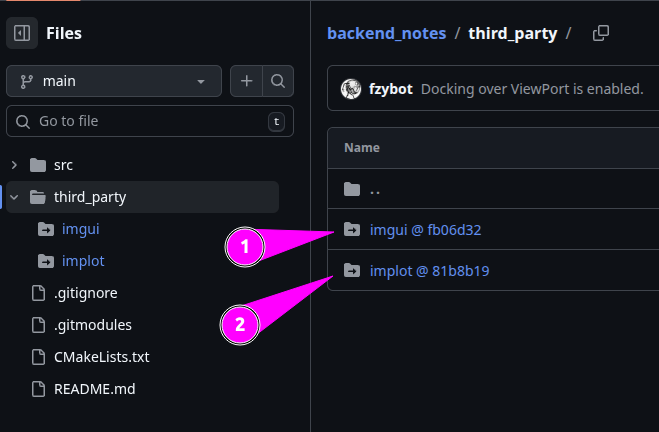

# Dear ImGui

Начнем с тех кто использует библиотеку [Dear Imgui](https://github.com/ocornut/imgui/wiki/Software-using-Dear-ImGui).


### SDL and OpenGL

`SDL2` - это [Simple DirectMedia Layer](https://www.libsdl.org/), то, что обычно называют "фреймворком". 
SDL упрощает обработку ввода, работу с **окнами**, **аудио** и тому подобное (хотя он также может делать какую-то очень базовую графику).
Он позаботятся о загрузке текстур и ресурсов, отрисовке на экране, воспроизведении аудио и т. д. Но им не хватает игрового шаблона, который есть у полноценного движка: например, **коллизий**, **физики**, **управления сценой** и т. д.

`OpenGL` - это [Open Graphics Library](https://www.opengl.org/) 3d графический API, он упрощает сложный рендеринг при использовании видеокарты. У видеокарт разные инструкции, поэтому он, по сути, преобразует то, что вы хотите нарисовать на экране, во что-то, что видеокарта может понять. `OpenGL`, `DirectX` и `Vulkan` - это большие графические `API` для работы с видеокартой.

### Особенности Immediate Mode GUI

Основными особенностями можно назвать:
- Интерфейс `ImGui` вызывается в **цикле**, каждая итерация цикла считается одним кадром.
- Перед началом кадра библиотека должна получить все данные касательно положения мыши, нажатых клавиш и прочих вводных.
- Затем вызывается функция, в которой пользователь библиотеки получает структуру ui, рисует свой интерфейс. В этот момент библиотека в реальном времени формирует все виджеты, для каждого виджета определяет попала ли на него мышь, и формирует вершины и треугольники, которые потом будут рисоваться.
- Теперь библиотека возвращает все сформированные **mesh'и** и отдаёт их на рисование **бэкенду**. Он рисует это на экран.
- И так повторяется **60 кадров** в секунду (или **больше**).

## Установка (подключение к проекту)

Допустим, мы захотели создать новый проект. Начнем с потенциальной структуры проекта:
```md
"имя_проекта"
├── include
│   ├── "заголовочные_файлы".h
├── src
│   ├── "исполняемые_файлы".cpp
│   └── main.cpp - самый главный исполняемый файл
├── third_party - сторонние проекты\библиотеки и т.д.
│   ├── imgui
│   ├── implot
│   └── и др.
├── README.md
├── CMakeLists.txt
├── .gitignore
├── .gitmodules
└── и пр.
```

### Сабмодули (Git Submodules)

Для подключения сторонних проектов в ваш репозиторий можно не просто копировать весь код проекта, а обернуть это намерение в виде `ссылки` на нужный вам репозиторий.

Осуществляется это про помощи команды `git submodule add "ссылка" "куда кладем" и т.д.`. [RU](https://git-scm.com/book/ru/v2/%D0%98%D0%BD%D1%81%D1%82%D1%80%D1%83%D0%BC%D0%B5%D0%BD%D1%82%D1%8B-Git-%D0%9F%D0%BE%D0%B4%D0%BC%D0%BE%D0%B4%D1%83%D0%BB%D0%B8), [ENG](https://git-scm.com/book/en/v2/Git-Tools-Submodules) ссылки на документацию.

Добавим в наш проект 2 репозитория, которые будем усердно изучать: [Dear Imgui](https://github.com/ocornut/imgui) и его дополнение для работы с графиками [Implot](https://github.com/epezent/implot).

```bash
git submodule add https://github.com/epezent/implot.git third_party/implot
git submodule add https://github.com/ocornut/imgui.git third_party/imgui
```
В данном случае я кладу оба проекта в директорию (см. дерево выше) `third_party`. 



Таким образом, получаем в виде ссылок сторонние проекты в нашем репозитории. Довольно удобно, не нужно скачивать и копировать все файлы. Также, можно привязываться к конкретному коммиту проекта (см. пример ниже).

`.gitmodules` выглядит следующим образом:
```bash
[submodule "third_party/imgui"]
	path = third_party/imgui
	url = https://github.com/ocornut/imgui.git
	branch = docking # указываем конкретную ветку (можно хэш коммита)
[submodule "third_party/implot"]
	path = third_party/implot
	url = https://github.com/epezent/implot.git

```
**ВАЖНО** обязательно выполните команду (репозитории скачаются на ваш компьютер):

```bash
git submodule update --remote --recursive
# или
git submodule update --init --recursive
```

### CMakeLists.txt (сборка проекта)

Допустим, у нас есть стандартная точка входа в нашу программу `"имя_проекта"/src/main.cpp` и мы хотим использовать её как стантартную библиотеку, например `#include <iostream>`:

`main.cpp`
```cxx
#include <iostream>

#include "imgui.h"
#include "implot.h"

int main(int argc, char *argv[]) {

    return 0;
}
```
Для этого необходимо сначала собрать наш проект. В нашем случае, при помощи "сборщика" `Cmake`.

Создаем (или открываем, если он уже есть) в корне директории файл CMakeLists.txt, в котором будут находится правила сборки вашего проекта:

`CMakeLists.txt`
```bash
cmake_minimum_required(VERSION 3.14)
project(backend_notes)

set(CMAKE_CXX_STANDARD 17)

set(THIRD_PARTY_DIR ${PROJECT_SOURCE_DIR}/third_party)
set(SRC_DIR ${PROJECT_SOURCE_DIR}/src)
set(INCLUDE_DIR ${PROJECT_SOURCE_DIR}/include)

# SDL2
find_package(SDL2 REQUIRED)
include_directories(${SDL2_INCLUDE_DIRS})

# OpenGL/GLEW
find_package(OpenGL REQUIRED)
find_package(GLEW REQUIRED)

include_directories(${INCLUDE_DIR})

add_library(imgui STATIC
    ${THIRD_PARTY_DIR}/imgui/imgui.cpp
    ${THIRD_PARTY_DIR}/imgui/imgui_draw.cpp
    ${THIRD_PARTY_DIR}/imgui/imgui_demo.cpp
    ${THIRD_PARTY_DIR}/imgui/imgui_tables.cpp
    ${THIRD_PARTY_DIR}/imgui/imgui_widgets.cpp
    ${THIRD_PARTY_DIR}/imgui/backends/imgui_impl_sdl2.cpp
    ${THIRD_PARTY_DIR}/imgui/backends/imgui_impl_opengl3.cpp
)
target_include_directories(imgui PUBLIC ${THIRD_PARTY_DIR}/imgui)
target_compile_options(imgui PRIVATE -fPIC)

add_library(implot STATIC
    ${THIRD_PARTY_DIR}/implot/implot.cpp
    ${THIRD_PARTY_DIR}/implot/implot_demo.cpp
    ${THIRD_PARTY_DIR}/implot/implot_items.cpp
)
target_include_directories(implot PUBLIC ${THIRD_PARTY_DIR}/implot)
target_link_libraries(implot PRIVATE imgui)
target_compile_options(implot PRIVATE -fPIC)

add_executable(main ${SRC_DIR}/main.cpp)
target_link_libraries(main PRIVATE imgui implot ${SDL2_LIBRARIES} ${OPENGL_LIBRARIES} ${GLEW_LIBRARIES})

```

- `set()` -  используется для определения, изменения или удаления переменных;

- `include_directories()` - указывает компилятору, где искать заголовочные файлы, используя директиву #include, аналогично флагу `-I` в `GCC/Clang`;

- `find_package()` - библиотека предоставляет [package configuration file](https://cmake.org/cmake/help/latest/manual/cmake-packages.7.html#package-configuration-file), который импортирует в `CMakeLists.txt` приложения таргет библиотеки. Этот файл, вместе с собранной библиотекой, ее публичными заголовочными файлами и некоторой другой информацией устанавливается в директорию, которая потом указывается в переменной `CMAKE_PREFIX_PATH` при сборке проекта.

- `add_library()` - создает цель (`target`) библиотеки из указанных исходных файлов, определяя её имя и тип (`STATIC`, `SHARED` или `MODULE`). Это ключевая команда для сборки библиотек, позволяющая управлять зависимостями и типами библиотек (**статические** .a/.lib, **динамические** .so/.dll или **плагины**).

- `STATIC` - Статическая библиотека представляет собой собрание *.`obj`-файлов библиотеки (**НЕ** исполняемый файл), который мы можем, указав линкеру, прицепить к нашей программе в момент компиляции. 

- `SHARED` - **УЖЕ** исполняемый файл. Динамическая линковка выполняется средствами платформы (операционной системы) в процессе работы программы. Все так же у нас в руках *.lib и *.h файлы, однако, теперь к ним добавляется `.dll` (`.so` для Linux). *.`lib`-файл теперь содержит **только вызовы** к `*.so`, где лежат непосредственно алгоритмы и которые вызываются уже на ходу, а не компилируются.

- `target_include_directories(imgui PUBLIC ${THIRD_PARTY_DIR}/imgui)` - При сборке самой библиотеки, добавляет эту папку в список путей, в которых компилятор ищет инклуды.


- `target_link_libraries()` - связываем исполняемые файлы или библиотеки (targets) с другими библиотеками, указывающая, какие файлы нужно подключить при линковке.

**Собираем**
```bash
mkdir build && cd build
cmake ../
make -j16 # вместо '16' можно указать другое количество потоков для компиляции.
```


Готово. Хотя бы компилируется.