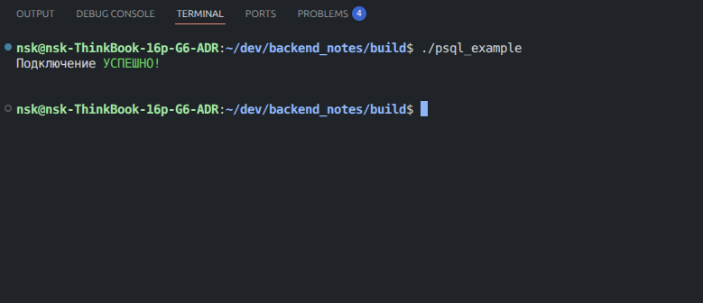
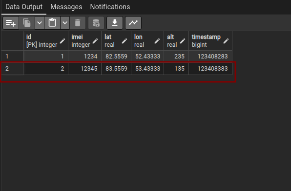

# Clang + PSQL

Пример взаимодействия приложения на языке `СИ` с базой данных `PSQL`. В этом нам поможет библиотека [libpq](https://postgrespro.ru/docs/postgresql/current/libpq), поддерживаемая разработчикеами `PSQL`.


## Установка и подключение библиотеки в CMake

**Устанавливаем**:
```bash
sudo apt install libpq-dev
```

**Подключаем в Cmake** (пример для простого `main.c`):

```cmake
# Ищем пакет PostgreSQL (в котором есть libpq)
find_package(PostgreSQL REQUIRED)

# Создаем исполняемый файл 
add_executable(main main.c)

# Линкуем к исполняемому файлу `main`
target_link_libraries(main PRIVATE PostgreSQL::PostgreSQL)
```

## Взаимодействие из кода СИ

Имя базы данных и кредиты пользователя сохранились из предыдущей "лекции".

### Пример подключения к БД
```c
/*
@author: https://github.com/FacelessProfile, Никита Шаламов
*/

#include <iostream>
#include <chrono>
#include <thread>
#include <cmath>

#include <libpq-fe.h>

#define HOST "localhost"
#define PORT "5432"
#define DB_NAME "test_db_from_psql"
#define DB_USER "postgres"               //по умолчанию postgres
#define DB_USER_PASSWORD "postgres1234" //Пароль от DB_USER


int main(int argc, char *argv[]) {

    PGconn *con;            // обьект подключения
    PGresult *res;          // результат запроса к базе

    const char* info = "host=" HOST " port=" PORT " dbname=" DB_NAME " user=" DB_USER " password=" DB_USER_PASSWORD;
    con = PQconnectdb(info);                // Выполняем SQL-запрос из переменной info

    if (PQstatus(con) != CONNECTION_OK){                      // если подключение не удалось пишем ошибку
            std::cerr << "\033[31mОШИБКА\033[0m подключения к БД.\n" << PQerrorMessage(con) << "\n";
            PQfinish(con);                                   // рвём подключение перед выходом
            exit(1);
    } else {
        std::cout << "Подключение \033[32mУСПЕШНО!\033[0m\n\n" << std::endl;
    }
    
    return 0;
}
```

**Результат**:




### Добавляем данные в таблицу

```c
const char* test_data[] = {"12345", "83.5559", "53.433332", "135.0", "123408383"};
std::string query =  std::string("INSERT INTO ") + std::string("user_equipment") + "(Imei, Lat, Lon, Alt, Timestamp)" + "VALUES ($1, $2, $3, $4, $5)";
PGresult* insert_res = PQexecParams(                // передаем параметры отдельно для защиты от SQL injection
    con,                                            // наше установленное соединение
    query.c_str(),                                  // строка запроса где table - таблица в БД
    5,                                              // количество переданных параметров
    NULL,                                           // типы данных (NULL - автотипизация)
    test_data,                                      // массив с данными
    NULL,                                           // длины данных
    NULL,                                           // формат (0 - текст)
    0                                               // результат текстом
    );

// проверяем успешен ли запрос на добавление в базу
if (PQresultStatus(insert_res) != PGRES_COMMAND_OK) {
    std::cerr << "\033[31mОШИБКА\033[0m:" << PQresultErrorMessage(insert_res) << "\n";
} else{
    std::cout << "Вставка произошла \033[32mУСПЕШНО!\033[0m\n";
}

PQclear(insert_res);
```

Результат:

