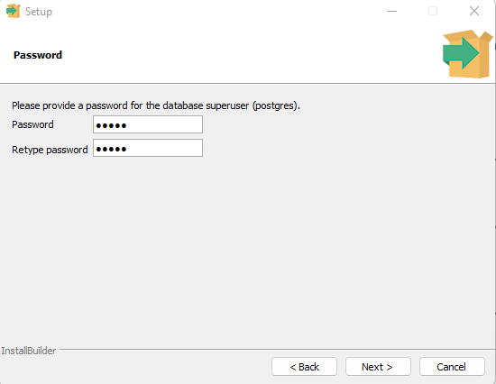
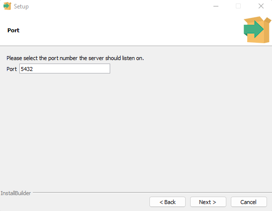
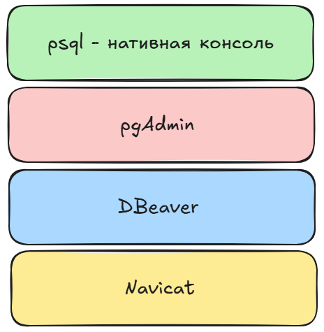
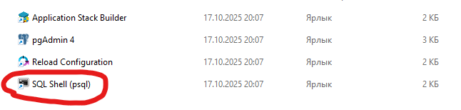

# PostgreSQL (Основы)

## Установка

Устанивливаем с [официального сайта](https://www.postgresql.org/download/). Делаем все по инструкции программы.

**Из важного** (важно для доступа):

1. Вводим и запоминаем пароль;

2. Запоминаем номер порта, по которуму будем осуществлять доступ к базе данных;

3. Остальное - **по умолчанию**.

`Ура, установили!`

## Подключение к СУБД

Работать с системой управления базой данных можно при помощи приложений:

1. `psql` - нативная консоль;
2. `pgAdmin` - [Open-source приложение](https://www.pgadmin.org/) по управлению `PostgreSQl`;
3. `DBeaver` - аналогично второму варианту, [ссылка](https://dbeaver.io/);
4. `Navicat` - тоже [визуальный интерфейс](https://www.navicat.com/ru/) для управления СУБД.

### psql - консоль

После установки полного пакета (если устанавливаем `по умолчанию`) `PostgreSQL` установится также приложение `psql`.

### pgAdmin 
