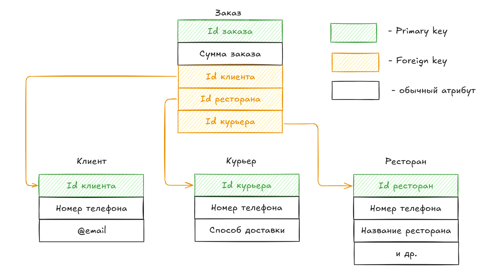

# Базы данных

Базы данных (далее `БД`) - это одна из основных (главных) сущностей информационных систем организаций и предприятий. `БД` представляет из себя набор совместно используемых логически связанных данных, также описание этих данных (**метаданные**).

Существует множество видов **баз данных**. Наиболее популярные типы:

- Реляционные базы данных (*табличные*);
- `Key`-`value` базы данных (**НЕреляционные**);
- Документно-ориентированные базы данных;
- Графовые базы данных;
- Колоночные базы данных.

Данные внутри `БД` могут быть структурированы по-разному - зависит от **модели данных**.
## Виды баз данных

### Реляционные базы данных

Реляционные базы данных строятся на **реляционной модели** данных. От слова **relation** - **отношение**, которое точно описывает внутреннюю структуру `БД`, но обычно такие базы данных называют **табличными**. 

**Таблицы** (`relation`) состоит из **кортежей** (строк), которые имеют однотипные *атрибуты* (столбцы). При этом один или несколько атрибутов считаются **первичным ключом** (Primary key), который **ДОЛЖЕН** быть **уникальным** для всех **кортежей** (строк) в этой таблице. При этом первичный ключ одной таблицы может использоваться как **внешний ключ** (`Foreign key`) в другой таблице, тем самым, связывая их между собой. 

Данные распределены по смыслу по таблицам. Между таблицами **есть отношения**.

`Primary key` – это столбец (или группа столбцов) таблицы, который содержит уникальные значения для каждой строки. На примере выше `primary key` выделен зеленым цветом.

`Foreign key` – это столбец в таблице, который содержит `primary key` другой таблицы.

#### SQL - Structured Query Language

Для взаимодействия с реляционными базами данных чаще всего используется язык `SQL` (`Structured Query Language`). 
