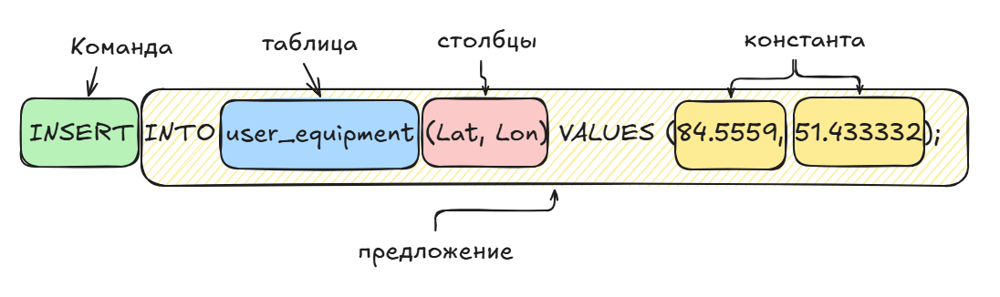

# Основы синтаксиса языка SQL

1. Каждая инструкция `SQL` начинается с **команды**, т.е. ключевого слова, описывающего действие, выполняемое инструкцией. Типичными командами являются
`CREATE` (создать), `INSERT` (добавить), `DELETE` (удалить) и `commit` (зафиксировать).
2. После команды идет одно или несколько **предложений**. **Предложение** может описывать данные, с которыми работает инструкция, или содержать уточняющую
информацию о действии, выполняемом инструкцией. 
3. Каждое предложение также начинается с ключевого слова, такого как `WHERE` (где), `FROM` (откуда), `INTO` (куда) или `НAVING` (имеющий).

**Работа с данными**
|Инструкция| Описание|
|---|---|
|`SELECT`|Извлекает данные из базы данных|
|`INSERT`|Добавляет новые строки в базу данных|
|`UPDATE`|Обновляет данные, имеющиеся в базе данных|
|`MERGE`|Добавляет/обновляет/удаляет новые и старые строки на основе условий|
|`DELETE`|Удаляет строки из базы данных|

**Определение данных**
|Инструкция| Описание|
|---|---|
|`CREATE TABLE`|**Добавляет новую таблицу в базу данных**|
|`DROP TABLE`|Удаляет таблицу из базы данных|
|`ALTER ТАВLЕ`|Изменяет структуру существующей таблицы|
|`CREATE VIEW`|Добавляет новое представление в базу данных|
|`DROP VIEW`|Удаляет предста вление из базы данных|
|`CREATE INDEX`|Создает индекс для столбца|
|`DROP INDEX`|Удаляет индекс столбца|
|`CREATE SСНЕМА`|Добавляет новую схему в базу данных|
|`DROP SСНЕМА`|Удаляет схему из базы данных|
|`CREATE DOМAIN`|Добавляет новый доме н значений данных|
|`ALTER DOМAIN`|Изменяет определение домена|
|`DROP DOМAIN`|Удаляет домен из базы данных|

**Управление транзакциями**
|Инструкция| Описание|
|---|---|
|`COMMIT`|Завершает текущую транзакцию|

