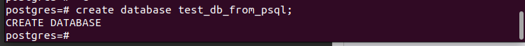
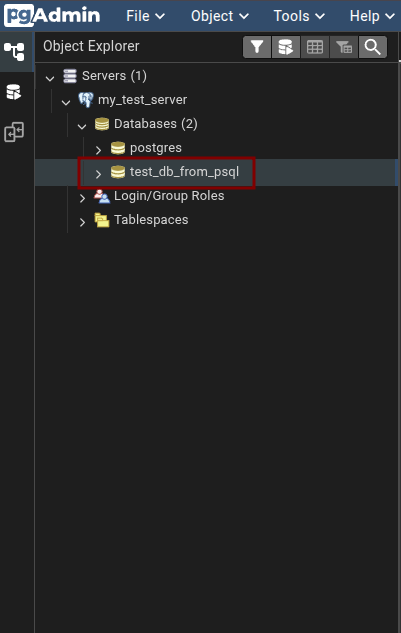
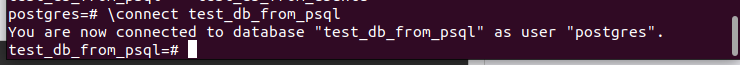
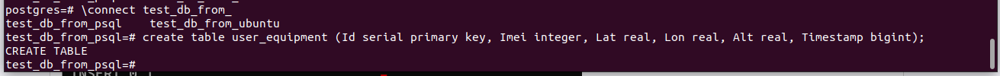
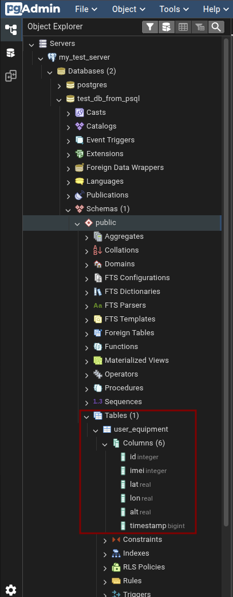
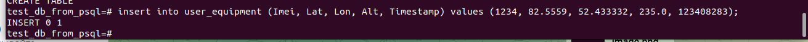
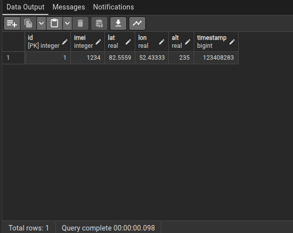

# Создание базы данных

Создать таблицу можно при помощи команды\бинарника `createdb` из терминала `Ubuntu`:

```bash
sudo -u postgres createdb test_db_from_ubuntu
```

**или** из консоли `psql`:

```bash
sudo -u postgres psql

create database test_db_from_psql;
```



Важно отметить, что для создания базы данных используем команду `create database <имя_базы_данных>;`, где точка с запятой **ОБЯЗАТЕЛЬНА**.

В интерфейсе **PgAdmin** увидим добавление новой базы данных:



<!-- ## Мета-команды psql

Все что начинается с обратного слэша (`\`) считается командой, которую обрабатывает непосредственно сам `psql`.  -->

## Подключение к базе данных (первая таблица)

Подключение к базе данных осуществляется при помощи команды `\connect` (или `\c` в сокращенной версии).

Выполняем команды находясь в `psql`-консоли:
```bash
\connect test_db_from_psql
```


### Создание таблицы
Для примера, создади таблицу `user_equipment` со столбцами об информации о его местоположении:

```bash
create table user_equipment (Id serial primary key, Imei integer, Lat real, Lon real, Alt real, Timestamp bigint);
```


, где для столбцов необходимо указать их `<название> <тип данных> ,`:

- столбец `Imei` с типом данных `integer`;
- столбец `Lat` с типом данных `real`;
- `Lon` `real`;
- `Alt` `real`;
- `Timestamp` `bigint`. 

В интерфейсе **PgAdmin** увидим добавление новой таблицы:



### Внесение данных в таблицу
Для примера добавим в нашу таблицу некоторые значения в след. формате:

```bash
insert into user_equipment (Imei, Lat, Lon, Alt, Timestamp) values (1234, 82.5559, 52.433332, 235.0, 123408283);
```



Чтобы посмотреть на записанные нами данные в **PgAdmin** нажимаем правой кнопкой мыши на нужную таблицу (`user_equipment` в нашем случае) и идем по пути `Viev/Edit Data` `->` `All Rows`:




### Получение данных из таблицы

Короткий пример по получению данных из таблицы:

```psql
select * from user_equipment;
```

Покажет нам всю информацию, находящуюся в таблице:


