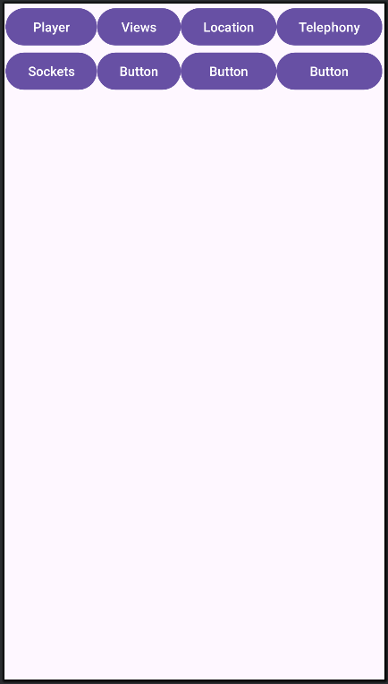

# Практические задания

### 0. Ведение Git-репозитория (требования)

1. Зарегистрироваться на `Github` (или аналоги);
2. Создать **ОДИН** репозиторий под `Android`-проект;
3. **НИКОГДА** не менять или создавать новый репозиторий при возникших проблемах с `commit`, `push`;
4. Репозиторий должен содержать 1 (**ОДНУ**) основную ветку, если не противоречит заданиюж;
5. На `Git`-репозиторий загружать весь `Android`-проект, **НЕ** просто файлы с `*.kt` или `*.xml`;
6. Сгенерировать SSH-ключ на вашем устройстве, привязать ключ к профилю в `Github.com`;
7. **Рекомендуется** добавить проверочную фразу к ключу;
8. Выполнить первый `commit` с обновленным README.MD, где будут указана информация о Вас (ФИО, № группы).

### 1. Основы ООП. "Ходячий"
1. Создать проект в `Intellij Idea` с названием вашего репозитория на `Github`, либо создать проект внутри директории, если вы уже связали репозиторий на `Github` с локальным на вашей машине;
2. Создвать новую ветку в вашем `Git-проекте` с названием практического задания;
3. В созданном проекте, по умолчанию будет создан `sample code`, в котором и будет продолжаться дальнейшая работа;
4. Создать Класс `Human`, с свойствами: `ФИО`, `Возраст`, `Текущая скорость`;
5. Класс должен содержать методы: конструктор со всеми свойствами, метод `move()`, геттеры и сеттеры свойств класса;
6. Метод `move()` должен реализовать один из методов моделирования движений (в Картезианской системе координат): Random Walk, Gauss-Markov Mobility Model;
7. В функции `main()` создать массив из экземпляров (количество зависит от вашего номер в списке группы) класса `Human()`, задать время "симуляции" (на свое усмотрение, в секундах), где в основном цикле "времени" заствить каждого Human ходить;
8. Сделать коммит (один или несколько) и обновить в удаленном репозитории (git push);
9. Слить текущую ветку в "основную\стартовую" после проверки преподавателем;
10. В файле Readme.md описать (с формулами) принцип работы модели движения, выбранной в пункте 6.


### 2. Наследование.
1. Создать новую ветку Вашего проекта, в которой будет выполняться практическая работа;
2. В качестве нового функционала добавить **класс-наследник** `Driver()`, который должен наследовать некоторые свойства (на ваше усмотрение) класса `Human()`;
3. Движение объектов (экземпляров) класса `Driver` должно быть **прямолинейным** (необходимо **переопределить** функцию `move()` родительского класса);
4. В основной фукнции `main()` создать (2-4 объекта `Human` и 1 объект `Dirve`);
5. В методе `move()` реализовать параллельное движение каждого из объектов, созданных ранее; Используем `Thread`;
8. Сделать `commit`, `push`;
9. Слить ветку в `main`.

**Почитать дома**:
- [Наследование](https://metanit.com/kotlin/tutorial/4.9.php) 
- [Mutex](https://medium.com/@appdevinsights/kotlin-mutex-375bfe4330b0)

### 3. Интерфейсы.
1. Создать новую ветку для реализации "интерфейса";
2. Создать интерфейс `Movable` с шаблонами `свойств` (координаты, скорость и т.д.) и `методов` (метод `move()`), необходимых для реализации движения объектов;
3. Провести рефакторинг текущей кодовой базы, в частности:
    1. Разделить классы\интерфейсы на файлы (1 класс = 1 файл);
    2. Обновить описание проекта в README.md с информацией по каждому файлу.
4. Обновить удаленный репозиторий. 

**Почитать дома**:
- [Интерфейсы](https://metanit.com/kotlin/tutorial/4.8.php) 

## Android
### 4. Разработка простейшего калькулятора
Разработать простую версию калькулятора, используя `TextView`, `Button` и обработчик нажатия (`onClickListener`).

**Требования к "калькулятору"**:

1. Калькулятор должен состояить из кнопок циферблата (от `0` до `9`);
2. Должен включать в состав `Layout` кнопки "действий" ( `+` , `-`, `*`, `/`, `=`);
3. Должен включать в состав `TextView` для отображения результата нажатия на  `Button`'s из пунктов 1 и 2.
4. При нажатии на `=` необходимо обработать строку из `TextView` вручную и выполнить записанные в строку операции;
5. Достаточно обработки **одной** операции, **нет** необходимости обработки нескольких операций.
6. Результата отправить на **Github** (или аналоги) репозиторий;
    1. Android-проект будет основным в ветке main\master;
    2. Заменить весь Ваш проект файлами `Android-studio`, оставив директорию с исходным кодом (переместить по схеме ниже).

**Репозиторий Git** все файлы предыдущего репозитория должны лежать внутри кода `Android`.
```md
app
├── manifests
│   └── AndroidManifets.xml
├── kotlin+java
|   ├── Movable/        # Ваш код с практик 1-3.
|   |   ├──Human.kt
|   |   └── и т.д.
|   └── MainActivity.kt
├── res
│   ├── drawable/
│   ├── layout/
│   ├── mipmap/
|   ├── values/
|   └── xml/
└── Gradle Scripts/
```

### 4.5. Рефакторинг. Разделение по Activities.

1. Из `MainActivity` необходимо создать некий `hub`, в котором будут отображаться кнопки перехода на другие `Activity`;
2. Функционал калькулятора из `ПР4` перенести на новое (необходимо создать)  новое `Activity`;
3. Реализовать метод перехода из `MainActivity` в другие при помощи кнопок.

**Пример** перехода но другое `Activity` при нажатии на кнопку `bGoToPlayerActivity`:
```kotlin
bGoToPlayerActivity.setOnClickListener({
        // Создаем Intent для класса MediaPlayerActivity - это MediaPlayerActivity.kt
        val randomIntent = Intent(this, MediaPlayerActivity::class.java)
        // Переходим в в другое Activity
        startActivity(randomIntent)
    });
```

**Пример** `MainActivity`



### 5. Разработать MediaPlayer для воспроизведения музыки

Цель: Научиться работать с файлами внутренней (или внешней) памяти смартфона, в частности, со звуковыми "дорожками". Исползование класса `MediaPlayer` поможет в создании "каркаса" для MP3-проигрователя. 

1. Создать новое `Activity` для работы с `MediaPlayer`;
2. MediaPlayer должен поддерживать функции: воспроизведение текущего трека, пауза текущего трека, обработка перехода `Activity` в состояние `onPause()`, регулировка громкости, `SeekBar` для отображения текущей длительности трека и его движение, перемотка трека (при помощи `SeekBar`);
3. Возможность вопроизводить музыку из хранилища телефона при помощи  [Permission](https://github.com/sibsutisTelecomDep/android_notes/blob/master/Examples/android_notes/app/src/main/java/com/example/android_notes/activities/MediaPlayerActivity.kt), строки 41-53;
4. Важно реализовать проверку текущего файла на директорию (`isDirectory`);
4. Отображение списка треков на экране `Activity`.

### 6. Местоположение смартфона. Location
 Цель: получить доступ к данным о местоположении Android-телефона и вывести на экран значения.
 За основу можно взять [пример](https://github.com/TelecomDep/android_notes/blob/master/Examples/android_notes/app/src/main/java/com/example/android_notes/activities/LocationActivity.kt).

 1. Создать `Activity` **Location**, в основном окне `MainActivity` добавить кнопку перехода в новую 'Activity';
 2. Получить доступ к классу [Location](https://developer.android.com/reference/android/location/Location) при помощи **permissions**: `ACCESS_FINE_LOCATION`, `ACCESS_COARSE_LOCATION`;
 3. Вывести в `Activity` данные о текущем (или последнем известном) местоположении смартфона:
    - [Latitude](https://developer.android.com/reference/android/location/Location#getLatitude());
    - [Longitude](https://developer.android.com/reference/android/location/Location#getLongitude());
    - [Altitude](https://developer.android.com/reference/android/location/Location#getAltitude());
    - [Current Time](https://developer.android.com/reference/android/location/Location#getTime());
4. Получить данные можно при помощи метода [getLastLocation()](https://developer.android.com/develop/sensors-and-location/location/retrieve-current)
5. При каждом обновлении местоположения записывать данные в файл (лучше в формате `Json`);
6. **ДОП. БАЛЛЫ**. Обернуть получение местоположения смартфона в [сервис](https://developer.android.com/develop/background-work/services) с целью записывать данные о местоположении в `backgroud`-режиме (когда приложение закрыто, `activity` не видно пользователю).

### 7. Данные о сетях мобильной связи (2G, 3G, 4G-LTE, 5G-NR)

1.  Создать новое `Activity`, добавив кнопку перехода основном "окне" `MainActivity`;
2. При помощи класса `Telephony` получаем информацию о сетях мобильной связи:
    1. [CellInfoLte](https://developer.android.com/reference/android/telephony/CellInfoLte): CellIdentityLte, CellSignalStrengthLte;
        1. CellIdentityLte: Band, CellIdentity, EARFCN, MCC, MNC, PCI, TAC;
        5. CellSignalStrengthLte: ASU Level, CQI, RSRP, RSRQ, RSSI, RSSNR, Timing Advance;
    2. [CellInfoGsm](https://developer.android.com/reference/android/telephony/CellInfoGsm): CellIdentityGSM, CellSignalStrengthGsm;
        1. CellIdentityGSM:  CellIdentity, BSIC, ARFCN, LAC, MCC, MNC, PSC;
        6. CellSignalStrengthGsm: Dbm, RSSI, Timing Advance;
    3. [CellInfoNr](https://developer.android.com/reference/android/telephony/CellInfoNr): CellIdentityNr, CellSignalStrengthNr
        1. CellIdentityNr: Band, NCI, PCI, Nrargcn, TAC, MCC, MNC;
        7. CellSignalStrengthNr: SS-RSRP, SS-RSRQ, SS-SINR, Timing Advance;
3. Ссылка на [пример получения данных](https://github.com/TelecomDep/android_notes/blob/master/Examples/android_notes/app/src/main/java/com/example/android_notes/activities/TelephonyActivity.kt). 

### 8. Реализация клиент-серверного приложения (Python\clang)
1. Создать новый репозиторий в профиле `github` (для backend-сервера);
2. В созданный репозиторий добавить Ваш проект `Android'a` как `submodule`;
3. В корне репозитория создать папку `examples/`, где будут находится примеры работы клиент-серверного приложения;
4. Создать 2 файла: `client.py`, `server.py`;
5. Реализовать передачу данных (можно просто "Hello World!") от клиента к серверу и обратно;
6. Посмотреть результат работы приложений в программе Wireshark, найти переданные сообщения;
7. Добавить еще один файл в `examples/`: `client.c` или `server.c`;
8. Реализовать соединение и передачу данных между примером на языке `Python` и примером на языке `СИ`;
9. `git commit` && `git push`.

### 9. Работа с сокетами (ZMQ). Передача данных от Android к PC
1. На базе [примера](https://github.com/TelecomDep/android_notes/blob/master/Examples/android_notes/app/src/main/java/com/example/android_notes/activities/SocketsActivity.kt) реализовать передачу данных внутри приложения `Android` (ваш предыдущий проект);
1. Создать новое `Activity`, в котором будет реализованы функции `клиента` и `сервера`;
    1. Реализовать начало передачу данных между сервером и клиентом при нажатии на кнопку (создать новую кнопку);
    1. Новый функционал должен находится в отдельной (от основной) ветке (создаем новую ветку (`branch`));
2. Наладить передачу данных от Вашего приложения (Android) на приложение-сервер на Вашем компьютере (или VPS, если имеется):
    1. `Сервер` (компьютер) - запустить серверную часть на базе языка `Python` + `ZMQ`;
    2. `Android` - выступает в роли клиента (на базе `ZMQ`), подключается к серверу;
    2. Ваш компьютер и телефон (`Android`) должны находится в одной сети (Wifi, USB, Internet (если есть белый `ip`-адрес));
    2. В роли данных со стороны `Android`-приложения выступает строка `"Hello from Andorid!"`;
    2. Данные со стороны сервера - `"Hello from Server!"`;
    2. `Серверная` часть **ДОЛЖНА** сохранить (в файл) каждый блок данных, пришедший со смартфона, и считать количество полученных пакетов.
    2. Серверная часть также должны иметь метод\функцию по выводу на экран (консоль) всех сохраненных данных;
3. `Git`: 
    1. `Android` - Сделать c merge request с новым функционалом;
    3. `Server` - добавить новый коммит, обновить удаленный репозиторий.


### 10. Сериализация. Data-классы. Формирование JSON.

1. В приложении `Android`, `Desktop-сервере` сформировать [Data-классы](https://metanit.com/kotlin/tutorial/4.12.php) для данных, которые будем передавать с между приложениями. Список данных:
    1. [Location](https://developer.android.com/reference/android/location/Location): Latitude, Longitude, Altitude, Timestamp, Speed, Accuracy;
    2. [CellInfoLte](https://developer.android.com/reference/android/telephony/CellInfoLte): CellIdentityLte, CellSignalStrengthLte;
        1. CellIdentityLte: Band, CellIdentity, EARFCN, MCC, MNC, PCI, TAC;
        5. CellSignalStrengthLte: ASU Level, CQI, RSRP, RSRQ, RSSI, RSSNR, Timing Advance;
    3. [CellInfoGsm](https://developer.android.com/reference/android/telephony/CellInfoGsm): CellIdentityGSM, CellSignalStrengthGsm;
        1. CellIdentityGSM:  CellIdentity, BSIC, ARFCN, LAC, MCC, MNC, PSC;
        6. CellSignalStrengthGsm: Dbm, RSSI, Timing Advance;
    4. [CellInfoNr](https://developer.android.com/reference/android/telephony/CellInfoNr): CellIdentityNr, CellSignalStrengthNr
        1. CellIdentityNr: Band, NCI, PCI, Nrarfcn, TAC, MCC, MNC;
        7. CellSignalStrengthNr: SS-RSRP, SS-RSRQ, SS-SINR, Timing Advance;
2. Заполнить каждый `Data-класс` актуальными данными с мобильного телефона (`Пр. №3`, `Пр. №4`);
3. Реализовать [Serialization](https://kotlinlang.org/docs/serialization.html#serialize-and-deserialize-json) и преобразование в `Json`, созданных вами классов:
    1. Структура на передачу **ДОЛЖНА** состоять из `Location` и одним из (или несколько, если позволяет производитель смартфона) объектов `CellInfo` (`GSM` или `LTE` или `NR`);
4. С заранее заданной периодичностью (допустим, `1 секунда`) передавать, сформированную структуру `Json`, с мобильного устройства на сервер.
5. На стороне сервера получать данные, выводить в терминал и сохранять данные в файл;


### 11. PostgreSQL. База данных (на стороне backend)

1. Создать базу данных при помощи средств **СУБД** (например, `PostgreSQL`) для храрения информации, полученной в `Пр. №10`.
    1. Создать базу данных при помощи psql-консоли (как [здесь](https://telecomdep.github.io/notes/DataBase/work_with_database.html));
    2. Создать таблицу, содержащую все необходимые атрибуты (**столбцы**), исходя из `Пр. №10`;
2. Добавить функцию работы backend-сервера с **СУБД** (PostgreSQL, например, как [тут](https://telecomdep.github.io/notes/DataBase/python_psql.html));

3. При каждом получении данных с `Android`-телефона, Ваш `backend-сервер` должен сохранять информацию в базе данных (используем **SQL-команду** `INSERT`);
4. Реализовать отображение данных о местоположении (в реальном времени) на стороне `backend-сервера`:
    1. Используем библиотеку `matplotlib`;
    2. Данные забираем из базы данных.

Итого, "**бэкэнд-севрер**" будет выглядеть (схематично, без `потоков`, `data-классов` и **прочей красоты**) след. образом:

```python
import psycopg2
import zmq

conn = psycopg2.connect(dbname="test_db_from_psql", host="localhost", user="postgres", password="postgres1234", port="5432")

context = zmq.Context()
socket = context.socket(zmq.REP)
socket.bind("tcp://*:5555")

while True:
    message = socket.recv() # Здесь получили данные от Android-приложения
    # Здесь записали в таблицу
    cursor.execute("INSERT INTO user_equipment (Imei, Lat, Lon, Alt, Timestamp) values (333, 84.5559, 51.433332, 225.0, 1233408283)") 
    conn.commit() # на самом деле ЗДЕСЬ.


cursor.close() # закрываем курсор
conn.close() 
```

