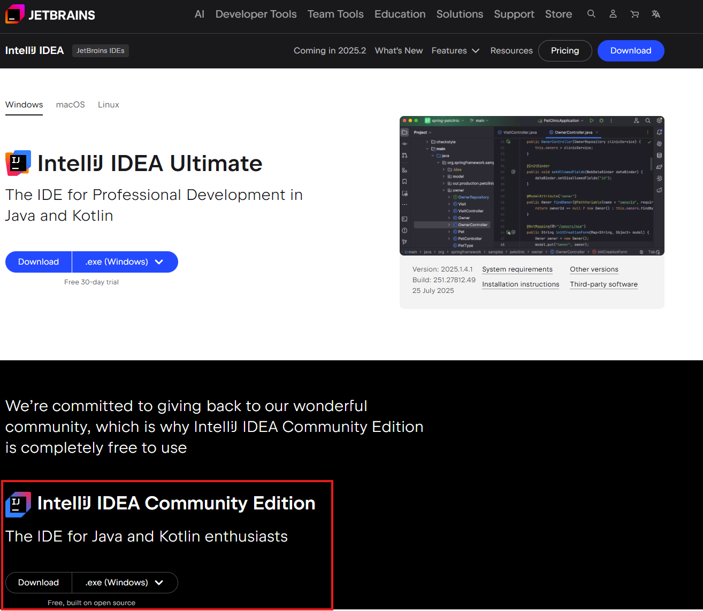

Установка средств разработки
===================================

Установка IntelliJ IDEA
---------------------

Компилировать и запускать программы на базе языка Kotlin можно в консоли (в терминале), однако, удобнее разрабатывать приложения более сложно порядка, чем `println(Hello World)`, при помощи серьезных IDE, таких как, например, IntelliJ Idea.

   IntelliJ IDEA Community Edition (free).