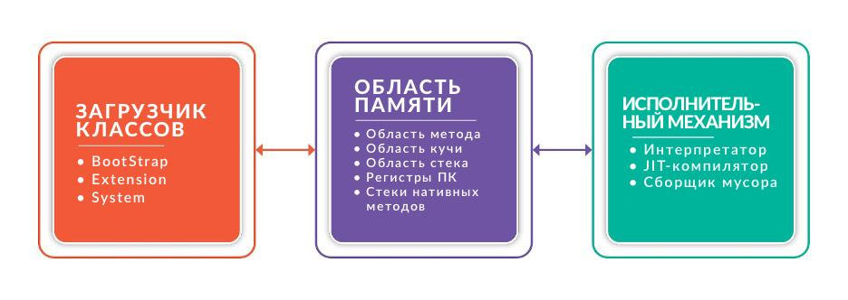

# Основы языка Kotlin

## Компиляция и JVM

## Виртуальная машина Java (JVM)

Виртуальная машина Java (JVM) была разработана компанией Sun Microsystems, а ключевую роль в ее создании сыграл Джеймс Гослинг. Позднее Sun Microsystems была приобретена компанией Oracle.  Слоганом компании является `Write once, run anywhere (WORA)`.

JVM, если кратко - это интерпретатор байт-кода **Java**. Главной особенностью JVM является возможность компиляции и запуска програм на, практически, любой платформе, не меняя при это код **Java** (сильно упращая жизнь разработчикам ПО). 

  
  <figcaption> Write Once Run Anywhere (WORA). <a href="https://habr.com/ru/companies/domclick/articles/500646/">Источник изображения.</a></figcaption>

  
  <figcaption> Write Once Compile Anywhere (WOCA). <a href="https://habr.com/ru/companies/domclick/articles/500646/">Источник изображения.</a></figcaption>

JVM может быть установлена на любую операционную систему (Windows, macOS, Unix-like, и т.д.). Таким образом, позволяя написать код один раз, но работать он будет на нескольких операционных системах. 

### Архитектура JVM и ее место в OS

Виртуальная машина Java является некой прослойкой между программным кодом и операционной системой:

  
  <figcaption> JVM and OS. <a href="https://www.nic.ru/help/jvm-chto-eto-kak-ustroena-virtual6naya-mashina-java_11250.html">Источник изображения.</a></figcaption>

В данном случае, под **программа** - это **байт-код**, инструкции которого понимает и выполняет JVM. 

JVM состоит из трех основных компонентов:

- загрузчик классов (Classloader);
- область данных runtime (временеи выполнения);
- исполнительный механизм (Execution Engine).

  
  <figcaption> Архитектура JVM. <a href="https://www.nic.ru/help/jvm-chto-eto-kak-ustroena-virtual6naya-mashina-java_11250.html">Источник изображения.</a></figcaption>

**Загрузчик классов**: Classloader отвечает за загрузку Java-классов с диска в память JVM, разрешение зависимостей между классами и инициализацию классов во время выполнения программы. Загрузчик классов следует иерархии делегирования, начиная с Bootstrap Classloader, затем Extension Classloader и Application Classloader.

**Области данных времени выполнения**: Во время выполнения программы JVM выделяет области памяти, называемые Runtime Data Areas. Эти области памяти включают в себя Heap, Stack, Method Area, Constant Pool и PC Registers, в которых хранятся данные, необходимые для различных аспектов жизненного цикла приложения.

**Execution Engine**: Execution Engine - это основной компонент, отвечающий за выполнение байткода Java. Механизм выполнения интерпретирует байткод и преобразует его в нативный машинный код во время выполнения. Он включает в себя такие компоненты, как интерпретатор, компилятор Just-In-Time (JIT) и сборщик мусора.

#### JVM Runtime Memory
Эффективное управление памятью - важнейший аспект архитектуры JVM, способствующий эффективному выполнению Java-приложений. JVM выделяет различные области памяти, называемые Runtime Data Areas, для различных типов хранения данных и манипулирования ими во время выполнения программы. 

  
  <figcaption> Архитектура JVM Runtime Memory. <a href="https://habr.com/ru/companies/domclick/articles/500646/">Источник изображения.</a></figcaption>

К основным областям памяти в JVM относятся:

**Куча**: Куча - это самая большая область памяти в JVM, которая разделяется между всеми потоками приложения. В ней хранятся инстанцированные объекты и массивы, созданные в процессе выполнения программы. Куча делится на области 'Young Generation' и 'Old Generation'. В области "молодого поколения" хранятся вновь созданные объекты, а в области "старого поколения" - объекты, пережившие несколько циклов сборки мусора.

**Стек**: JVM создает отдельный стек для каждого потока. В стеке хранится информация о вызовах методов, локальные переменные и промежуточные результаты вычислений во время выполнения программы. Каждая запись в стеке называется фреймом стека, и JVM управляет фреймами стека независимо для каждого вызова метода.

**Область методов**: Область методов разделяется между всеми потоками приложения и хранит данные класса, такие как имена методов, имена переменных и значения констант. Область методов также содержит пул констант, в котором хранятся постоянные значения и символьные ссылки, используемые байткодом.

**Регистры PC**: Регистр PC (Program Counter) - это область памяти, содержащая адрес текущей выполняемой JVM инструкции для каждого потока. Регистр PC помогает JVM отслеживать, какая инструкция будет выполняться следующей.

#### Загрузчик классов
Загрузка классов — это поиск и загрузка типов (классов и интерфейсов) динамически во время выполнения программы. Данные о типах находятся в бинарных class-файлах.
Подсистема загрузчика классов отвечает не только за поиск и импорт бинарных данных класса. Она также выполняет проверку правильности импортируемых классов, выделяет и инициализирует память для переменных класса, помогает в разрешении символьных ссылок. Эти действия выполняются в следующем порядке:

  
  <figcaption> Загрузчик классов. <a href="https://appmaster.io/ru/blog/arkhitektura-virtual-noi-mashiny-java">Источник изображения.</a></figcaption>

- **Загрузка (loading)** — это процесс получения файлов классов с диска и их загрузки в память JVM. Загрузчик классов находит нужные файлы классов по полному имени класса, которое включает имя пакета и имя класса.
- **Связывание, линковка (linking)** — Процесс связывания устанавливает связи между классами и проверяет их на наличие несоответствий или ошибок. Состоит из:
  - **Верификация (verification)** — проверка корректности импортируемого типа.
  - **Подготовка (preparation)** — выделение памяти для статических переменных класса и инициализация памяти значениями по умолчанию.
  - **Разрешение (resolution)** — преобразование символьных ссылок типов в прямые ссылки.
- **Инициализация (initialization)** — вызов Java-кода, который инициализирует переменные класса их правильными начальными значениями.

#### Управление памятью JVM

### Файл .class и байт-код

До изучания основ синтаксиса языка Kotlin, следует освоить основы его компиляции и зачем нужна JVM.

Процесс компиляции кода происходит следующим образом:

  
  <figcaption> Процесс компиляции в языке Kotlin. <a href="https://habr.com/ru/companies/inforion/articles/330060/">Источник изображения.</a></figcaption>

На вход компилятора `kotlinc` поступают исходные файлы. Важно отметить, что java-файлы также поступают на вход компилятора. Это необходимо для возможности ссылаться на Java из Kotlin и наоборот. Далее, полученные файлы `*.class` передаются на компилятор `javac` вместе с исходными java-файлами. В итоге, компилируются все java-файлы, после чего собираются в файлы `.jar`.

