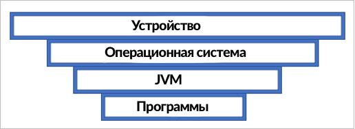

# Основы языка Kotlin

## Цели создания виртуальной машины Java (JVM)

Виртуальная машина Java (JVM) была разработана компанией Sun Microsystems, а ключевую роль в ее создании сыграл Джеймс Гослинг. Позднее Sun Microsystems была приобретена компанией Oracle.  Слоганом компании является `Write once, run anywhere (WORA)`.

JVM, если кратко - это интерпретатор байт-кода **Java**. Главной особенностью JVM является возможность компиляции и запуска програм на, практически, любой платформе, не меняя при это код **Java** (сильно упращая жизнь разработчикам ПО). 
<p align="center">
  
  <figcaption> Write Once Run Anywhere (WORA). <a href="https://habr.com/ru/companies/domclick/articles/500646/">Источник изображения.</a></figcaption>
</p>

<p align="center">
  
  <figcaption> Write Once Compile Anywhere (WOCA). <a href="https://habr.com/ru/companies/domclick/articles/500646/">Источник изображения.</a></figcaption>
</p>

JVM может быть установлена на любую операционную систему (Windows, macOS, Unix-like, и т.д.). Таким образом, позволяя написать код один раз, но работать он будет на нескольких операционных системах. 

## Архитектура взаимодействия Kotlin с JDK (Java Development Kit)

Виртуальная машина Java является некой прослойкой между программным кодом и операционной системой:
<p align="center">
  
  <figcaption> JVM and OS. <a href="https://www.nic.ru/help/jvm-chto-eto-kak-ustroena-virtual6naya-mashina-java_11250.html">Источник изображения.</a></figcaption>
</p>

Компилятор языков программирования Java и Kotlin преобразует **пользовательскую программу** в, так называемый, **байт-код**. Данный байт-код уже понимает виртуальная машина Java (**JVM**)
Ниже рассмотрим более подробно этапы компиляции и запуска приложения, написанного на языке Kotlin (Kotlin + JVM).

<p align="center">
  
  <figcaption> Архитектура взаимодействия Kotlin + JVM.</figcaption>
</p>

Кратко по каждому блоку:
1. Инструменты разработки `Java (JDT)` - это набор расширений рабочей среды, с помощью которого можно редактировать, компилировать и запускать программы на Java.
  1.1. `javac` - компилятор языка Java. Преобразует `*.java` в байт-код `*.class`;
  1.2. `javap` - дизассемблер языка Java. Применяет обратную опереацию `javac`, преобразует `*.class` в понятный человеку формат;
  1.3. `VisualVM` - удобная утилита для визуализации, мониторинга, профилирования приложений Java;
  1.4. `Other` - набор доп. инструментов (Basic Tools, Security Tools, Monitoring and Troubleshooting Tools, Deployment Tools, etc.);

2. `Kotlin Multiplatform` - включает в себя компилятор для разны сред разработки (JVM, JS, Native);
  2.1. `kotlinc` - компилятор языка Kotlin. Преобразует `*.kt` в `байт-код`, понятный `JVM`. 
  2.2. etc.

3. `JRE (Java Runtime Environment)` - среда выполнения Java. Необходима для запуска программ. Состоит из:
  3.1. Виртуальной машины Java (`JVM`) - сердце работы программ;
  3.2. Стандартная библиотека классов Java (`java.io`, `java.lang`, `java.math`, `java.net`, etc.).

### Байт-код

Запустим `Intellij Idea`, создадим простой проект для демонстрации компиляции из `*.kt` в `*.class`.

В созданном проекте откроем файл `/src/application.kt` (создается по умолчанию, если не менять настройки). Добавим немного кода:

```kotlin
fun main(){ // Точка входа в программу

    var number_01: Int = 10
    var number_02: Int = 30
    println(number_01)
    println(number_02)

    number_01 *= 2
    number_02 += 20

    println(number_01)
    println(number_02)
    println("Hello world!")

}
```
С помощью встроенных инструментов Intellij IDEA (`Tools` -> `Kotlin` -> `Show Kotlin Bytecode`) получаем дизассемблированный байткод.

```kotlin
// ================ApplicationKt.class =================
// class version 52.0 (52)
// access flags 0x31
public final class ApplicationKt {

  // compiled from: application.kt

  @Lkotlin/Metadata;(mv={2, 2, 0}, k=2, xi=48, d1={"\u0000\u0008\n\u0000\n\u0002\u0010\u0002\n\u0000\u001a\u0006\u0010\u0000\u001a\u00020\u0001\u00a8\u0006\u0002"}, d2={"main", "", "HelloKotlin"})

  // access flags 0x19
  public final static main()V
   L0
    LINENUMBER 3 L0
    BIPUSH 10
    ISTORE 0
   L1
    LINENUMBER 4 L1
    BIPUSH 30
    ISTORE 1
   L2
    LINENUMBER 5 L2
    IINC 1 20
   L3
    LINENUMBER 7 L3
    GETSTATIC java/lang/System.out : Ljava/io/PrintStream;
    ILOAD 0
    INVOKEVIRTUAL java/io/PrintStream.println (I)V
   L4
    LINENUMBER 8 L4
    GETSTATIC java/lang/System.out : Ljava/io/PrintStream;
    ILOAD 1
    INVOKEVIRTUAL java/io/PrintStream.println (I)V
   L5
    LINENUMBER 9 L5
    RETURN
   L6
    LOCALVARIABLE number_01 I L1 L6 0
    LOCALVARIABLE number_02 I L2 L6 1
    MAXSTACK = 2
    MAXLOCALS = 2

  // access flags 0x1009
  public static synthetic main([Ljava/lang/String;)V
   L0
    INVOKESTATIC ApplicationKt.main ()V
    RETURN
   L1
    LOCALVARIABLE args [Ljava/lang/String; L0 L1 0
    MAXSTACK = 0
    MAXLOCALS = 1
}
```

На данный момент не очень понятны команды `BIPUSH`, `ISTORE`, `ILOAD` и т.д.
Для этого необходимо немного погрузиться в кухню **Java Virtual Machine**.

### Виртуальная машина Java (JVM)

<!-- ### Архитектура
### Архитектура
### Архитектура -->

<!-- JVM состоит из трех основных компонентов:

- загрузчик классов (Classloader);
- область данных runtime (времени выполнения);
- исполнительный механизм (Execution Engine).

**Загрузчик классов**: Classloader отвечает за загрузку Java-классов с диска в память JVM, разрешение зависимостей между классами и инициализацию классов во время выполнения программы. Загрузчик классов следует иерархии делегирования, начиная с Bootstrap Classloader, затем Extension Classloader и Application Classloader.

**Области данных времени выполнения**: Во время выполнения программы JVM выделяет области памяти, называемые Runtime Data Areas. Эти области памяти включают в себя Heap, Stack, Method Area, Constant Pool и PC Registers, в которых хранятся данные, необходимые для различных аспектов жизненного цикла приложения.

**Execution Engine**: Execution Engine - это основной компонент, отвечающий за выполнение байткода Java. Механизм выполнения интерпретирует байткод и преобразует его в нативный машинный код во время выполнения. Он включает в себя такие компоненты, как интерпретатор, компилятор Just-In-Time (JIT) и сборщик мусора.

#### JVM Runtime Memory
Эффективное управление памятью - важнейший аспект архитектуры JVM, способствующий эффективному выполнению Java-приложений. JVM выделяет различные области памяти, называемые Runtime Data Areas, для различных типов хранения данных и манипулирования ими во время выполнения программы. 

<p align="center">
  
  <figcaption> Архитектура JVM Runtime Memory. <a href="https://habr.com/ru/companies/domclick/articles/500646/">Источник изображения.</a></figcaption>
</p>

К основным областям памяти в JVM относятся:

**Куча**: Куча - это самая большая область памяти в JVM, которая разделяется между всеми потоками приложения. В ней хранятся инстанцированные объекты и массивы, созданные в процессе выполнения программы. Куча делится на области 'Young Generation' и 'Old Generation'. В области "молодого поколения" хранятся вновь созданные объекты, а в области "старого поколения" - объекты, пережившие несколько циклов сборки мусора.

**Стек**: JVM создает отдельный стек для каждого потока. В стеке хранится информация о вызовах методов, локальные переменные и промежуточные результаты вычислений во время выполнения программы. Каждая запись в стеке называется фреймом стека, и JVM управляет фреймами стека независимо для каждого вызова метода.

**Область методов**: Область методов разделяется между всеми потоками приложения и хранит данные класса, такие как имена методов, имена переменных и значения констант. Область методов также содержит пул констант, в котором хранятся постоянные значения и символьные ссылки, используемые байткодом.

**Регистры PC**: Регистр PC (Program Counter) - это область памяти, содержащая адрес текущей выполняемой JVM инструкции для каждого потока. Регистр PC помогает JVM отслеживать, какая инструкция будет выполняться следующей.


#### Загрузчик классов
Загрузка классов — это поиск и загрузка типов (классов и интерфейсов) динамически во время выполнения программы. Данные о типах находятся в бинарных class-файлах.
Подсистема загрузчика классов отвечает не только за поиск и импорт бинарных данных класса. Она также выполняет проверку правильности импортируемых классов, выделяет и инициализирует память для переменных класса, помогает в разрешении символьных ссылок. Эти действия выполняются в следующем порядке:

<p align="center">
  
  <figcaption> Загрузчик классов. <a href="https://appmaster.io/ru/blog/arkhitektura-virtual-noi-mashiny-java">Источник изображения.</a></figcaption>
</p>

- **Загрузка (loading)** — это процесс получения файлов классов с диска и их загрузки в память JVM. Загрузчик классов находит нужные файлы классов по полному имени класса, которое включает имя пакета и имя класса.
- **Связывание, линковка (linking)** — Процесс связывания устанавливает связи между классами и проверяет их на наличие несоответствий или ошибок. Состоит из:
  - **Верификация (verification)** — проверка корректности импортируемого типа.
  - **Подготовка (preparation)** — выделение памяти для статических переменных класса и инициализация памяти значениями по умолчанию.
  - **Разрешение (resolution)** — преобразование символьных ссылок типов в прямые ссылки.
- **Инициализация (initialization)** — вызов Java-кода, который инициализирует переменные класса их правильными начальными значениями.

#### Управление памятью JVM


### Файл .class и байт-код

До изучания основ синтаксиса языка Kotlin, следует освоить основы его компиляции и зачем нужна JVM.

Процесс компиляции кода происходит следующим образом:
<p align="center">
  
  <figcaption> Процесс компиляции в языке Kotlin. <a href="https://habr.com/ru/companies/inforion/articles/330060/">Источник изображения.</a></figcaption>
</p>

На вход компилятора `kotlinc` поступают исходные файлы. Важно отметить, что java-файлы также поступают на вход компилятора. Это необходимо для возможности ссылаться на Java из Kotlin и наоборот. Далее, полученные файлы `*.class` передаются на компилятор `javac` вместе с исходными java-файлами. В итоге, компилируются все java-файлы, после чего собираются в файлы `.jar`.
 -->
