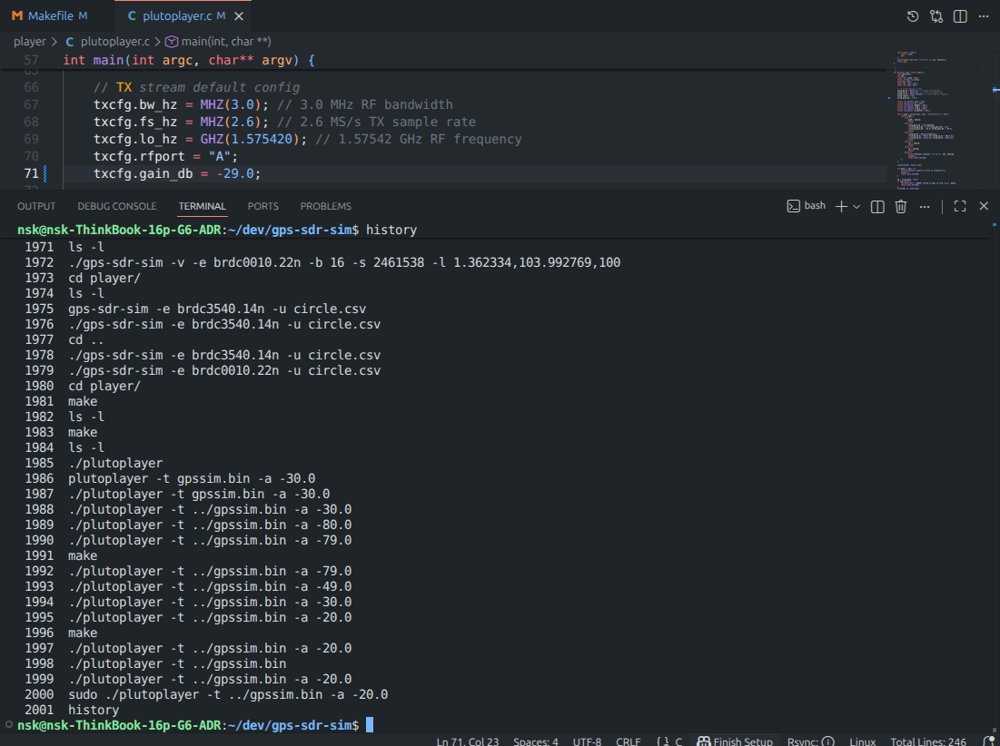

Имитация GNSS данных (Adalm Pluto SDR) и декодирование (USRP B200)
============

Имитация GNSS (Adalm Pluto)
---------------------

   Пример формирования GNSS-данных и излучения при помощи SDR Adalm Pluto.

Декодирование (USRP B200)
---------------------

Установка зависимостей и компиляция
'''''''''''''

.. code-block:: bash

    sudo apt install build-essential cmake git pkg-config libboost-dev libboost-date-time-dev \
    libboost-system-dev libboost-filesystem-dev libboost-thread-dev libboost-chrono-dev \
    libboost-serialization-dev liblog4cpp5-dev libuhd-dev gnuradio-dev gr-osmosdr \
    libblas-dev liblapack-dev libarmadillo-dev libgflags-dev libgoogle-glog-dev \
    libssl-dev libpcap-dev libmatio-dev libpugixml-dev libgtest-dev \
    libprotobuf-dev libcpu-features-dev protobuf-compiler python3-mako

Настройка драйвера UHD для USRP B200
.............

Проверить установленную версию UHD можно:

.. code-block:: bash

    uhd_find_devices 

Далее, вы увидите след. сообщение: ``[INFO] [UHD] linux; GNU C++ version 13.3.0; Boost_108300; UHD_4.9.0.0-0ubuntu1~noble3``

Для работы с ``USRP B200`` необходимо скачать **драйвера** (или образы) и поместить в директорию образов.
Скачать файлы образов для работы USRP B200 можно по `ссылке здесь <https://github.com/TelecomDep/uhd_images/upload>`_

.. code-block:: bash

    sudo cp usrp_b200_fw.hex /usr/share/uhd/images/
    sudo cp usrp_b200_fpga.rpt /usr/share/uhd/images/
    sudo cp usrp_b200_fpga.bin /usr/share/uhd/images/

    sudo cp usrp_b200_fw.hex /usr/share/uhd/<версия UHD>/images/
    sudo cp usrp_b200_fpga.rpt /usr/share/uhd/<версия UHD>/images/
    sudo cp usrp_b200_fpga.bin /usr/share/uhd/<версия UHD>/images/

Клонируем проект:

.. code-block:: bash

    git clone https://github.com/gnss-sdr/gnss-sdr

Запуск
'''''''''''''

Конфиг файл ``USRP B200``:

.. code-block::

    ; This is a GNSS-SDR configuration file
    ; The configuration API is described at https://gnss-sdr.org/docs/sp-blocks/
    ; SPDX-License-Identifier: GPL-3.0-or-later
    ; SPDX-FileCopyrightText: (C) 2010-2020  (see AUTHORS file for a list of contributors)

    ; Configuration file for using USRP 1 as a RF front-end for GPS L1 signals.
    ; Run:
    ; gnss-sdr --config_file=/path/to/gnss-sdr_GPS_L1_USRP_realtime.conf
    ;

    [GNSS-SDR]

    ;######### GLOBAL OPTIONS ##################
    ;internal_fs_sps: Internal signal sampling frequency after the signal conditioning stage [samples per second].
    GNSS-SDR.internal_fs_sps=2000000
    GNSS-SDR.telecommand_enabled=true
    GNSS-SDR.telecommand_tcp_port=3333

    ;######### SUPL RRLP GPS assistance configuration #####
    ; Check https://www.mcc-mnc.com/
    ; On Android: https://play.google.com/store/apps/details?id=net.its_here.cellidinfo&hl=en
    GNSS-SDR.SUPL_gps_enabled=true
    GNSS-SDR.SUPL_read_gps_assistance_xml=true
    GNSS-SDR.SUPL_gps_ephemeris_server=supl.google.com
    GNSS-SDR.SUPL_gps_ephemeris_port=7275
    GNSS-SDR.SUPL_gps_acquisition_server=supl.google.com
    GNSS-SDR.SUPL_gps_acquisition_port=7275
    GNSS-SDR.SUPL_MCC=250
    GNSS-SDR.SUPL_MNC=1
    GNSS-SDR.SUPL_LAC=0x59e2
    GNSS-SDR.SUPL_CI=0x31b0

    ;######### SIGNAL_SOURCE CONFIG ############
    SignalSource.implementation=UHD_Signal_Source
    ;SignalSource.device_address=192.168.40.2 ; <- PUT THE IP ADDRESS OF YOUR USRP HERE
    SignalSource.item_type=gr_complex
    SignalSource.sampling_frequency=2000000
    SignalSource.freq=1575420000
    SignalSource.gain=60
    SignalSource.subdevice=A:A
    SignalSource.samples=0
    SignalSource.repeat=false
    SignalSource.dump=false
    SignalSource.dump_filename=./signal_source.dat

    ;######### SIGNAL_CONDITIONER CONFIG ############
    SignalConditioner.implementation=Pass_Through

    ;######### CHANNELS GLOBAL CONFIG ############
    Channels_1C.count=8
    Channels_1B.count=0
    Channels.in_acquisition=1

    ;#signal:
    ;# "1C" GPS L1 C/A
    ;# "1B" GALILEO E1 B (I/NAV OS/CS/SoL)
    ;# "1G" GLONASS L1 C/A
    ;# "2S" GPS L2 L2C (M)
    ;# "5X" GALILEO E5a I+Q
    ;# "L5" GPS L5

    Channel.signal=1C

    ;######### ACQUISITION GLOBAL CONFIG ############
    Acquisition_1C.implementation=GPS_L1_CA_PCPS_Acquisition
    Acquisition_1C.item_type=gr_complex
    Acquisition_1C.coherent_integration_time_ms=1
    Acquisition_1C.threshold=0.01
    ;Acquisition_1C.pfa=0.0001
    Acquisition_1C.doppler_max=50000
    Acquisition_1C.doppler_step=250
    Acquisition_1C.bit_transition_flag=false
    Acquisition_1C.max_dwells=1
    Acquisition_1C.dump=false
    Acquisition_1C.dump_filename=./acq_dump.dat

    ;######### TRACKING GLOBAL CONFIG ############
    Tracking_1C.implementation=GPS_L1_CA_DLL_PLL_Tracking
    Tracking_1C.item_type=gr_complex
    Tracking_1C.pll_bw_hz=30.0;
    Tracking_1C.dll_bw_hz=4.0;
    Tracking_1C.order=3;
    Tracking_1C.early_late_space_chips=0.5;
    Tracking_1C.dump=false
    Tracking_1C.dump_filename=./tracking_ch_

    ;######### TELEMETRY DECODER GPS CONFIG ############
    TelemetryDecoder_1C.implementation=GPS_L1_CA_Telemetry_Decoder
    TelemetryDecoder_1C.dump=false

    ;######### OBSERVABLES CONFIG ############
    Observables.implementation=Hybrid_Observables
    Observables.dump=false
    Observables.dump_filename=./observables.dat

    ;######### PVT CONFIG ############
    ;#implementation: Position Velocity and Time (PVT) implementation:
    PVT.implementation=RTKLIB_PVT
    PVT.positioning_mode=Single
    PVT.output_rate_ms=100
    PVT.display_rate_ms=1000
    PVT.iono_model=Broadcast
    PVT.trop_model=Saastamoinen
    PVT.flag_rtcm_server=true
    PVT.flag_rtcm_tty_port=false
    PVT.rtcm_dump_devname=/dev/pts/1
    PVT.rtcm_tcp_port=2101
    PVT.rtcm_MT1019_rate_ms=5000
    PVT.rtcm_MT1077_rate_ms=1000
    PVT.rinex_version=2
    PVT.enable_monitor=true
    PVT.monitor_client_addresses=127.0.0.1
    PVT.monitor_udp_port=1111

    ;######### MONITOR CONFIG ############
    Monitor.enable_monitor=true
    Monitor.decimation_factor=1
    Monitor.client_addresses=127.0.0.1
    Monitor.udp_port=1112

Запускаем:

.. code-block:: bash

  cd build/src/main/
  sudo ./gnss-sdr --config_file=gnss-sdr_GPS_L1_plutosdr_realtime.conf --log_dir=logs
