Gitverse
============

1. Заходим по ссылке: `<https://gitverse.ru/>`_
2. Шаблон репозитория ППС: `<https://gitverse.ru/KAA85/reverse-engineering-demo>`_
3. Инструкция по работе с репозитрием: `инструкция <https://gitverse.ru/KAA85/reverse-engineering-demo/content/master/инструкция-по-работе-с-репозиторием-ППС.md>`_

Регистрация
---------------------

1) Нажимаем ``Начать работу``:

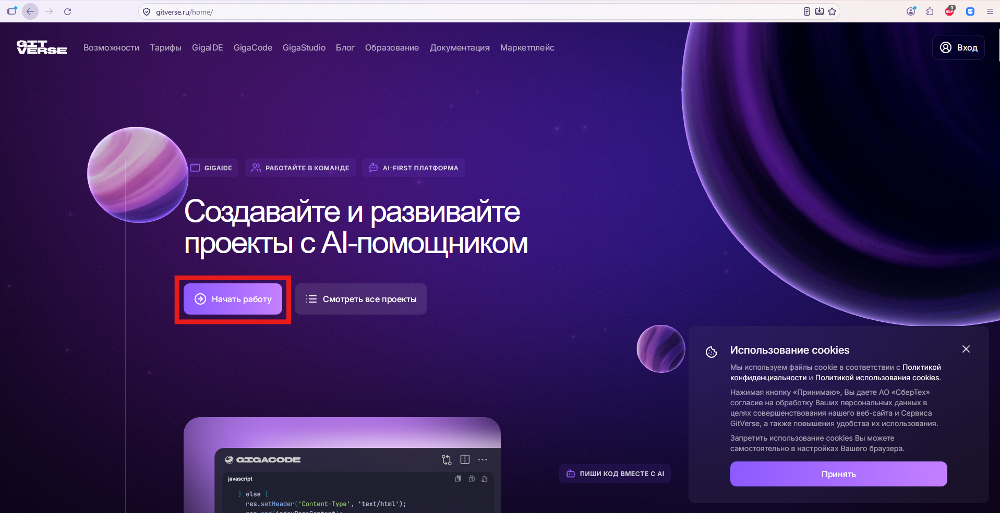

   Страница регистрации.

2) Войти по ``GigaID``:

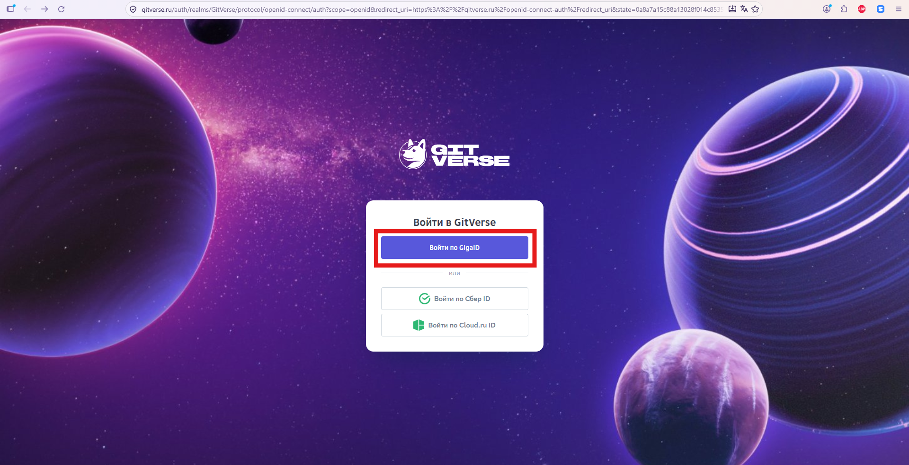

   Регистрируемся при помощи GigaID.

3) Если у Вас нет учетной записи - ``Создать GigaID``:

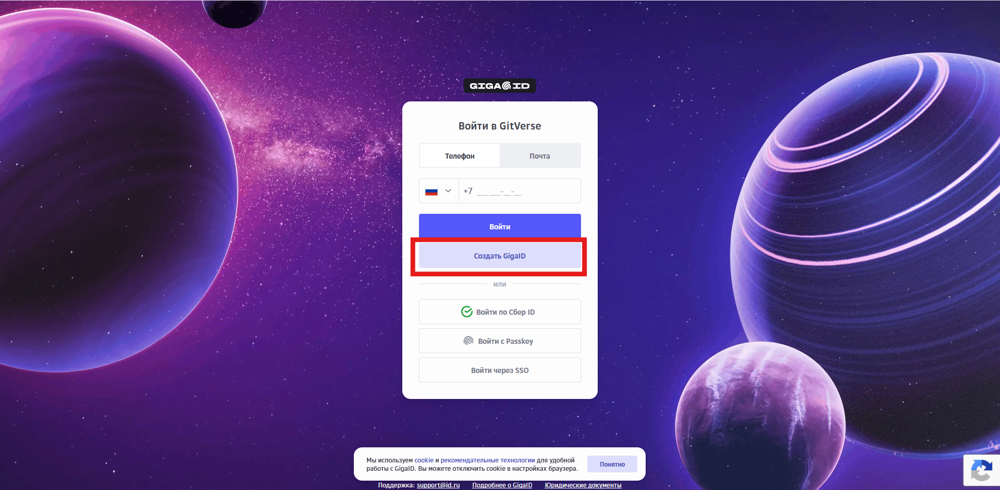

   Создать GigaID.

4) Пример регистрации по почтовому адресу **СибГУТИ** (если нет, идем в **ОИТ** и получаем):

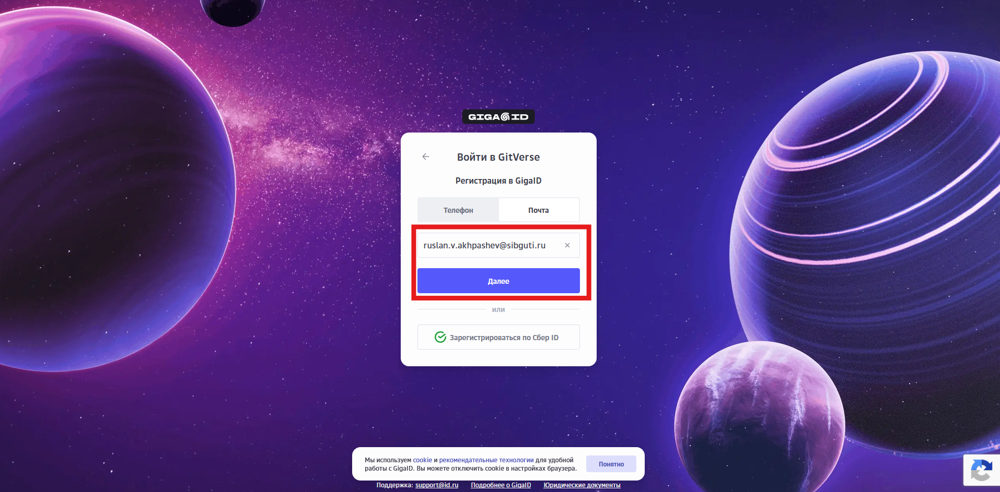

   Регистрация по почте СибГУТИ.

5) На почту придет ``Код подтверждения``, вводим:

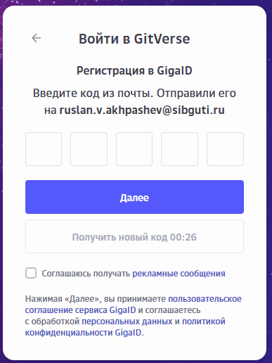

   Код подтверждения на почту.

6) Далее, попросит привязать номер телефона:

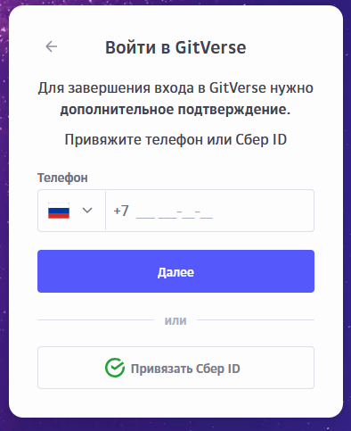

   Привязываем номер телефона.

7) Придет **СМС** с кодом подтверждения, вводим:

   Код подтверждения СМСкой.

8) Придумать имя пользователя ``Girverse``:

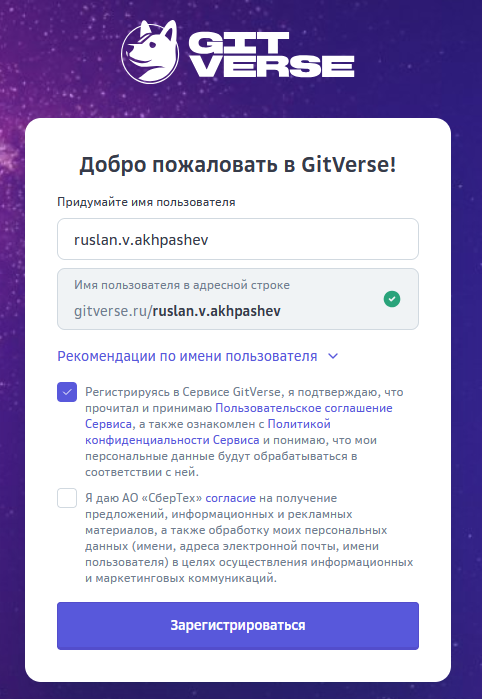

   Придумать имя пользователя.

9) Вуаля, создали учетную запись:

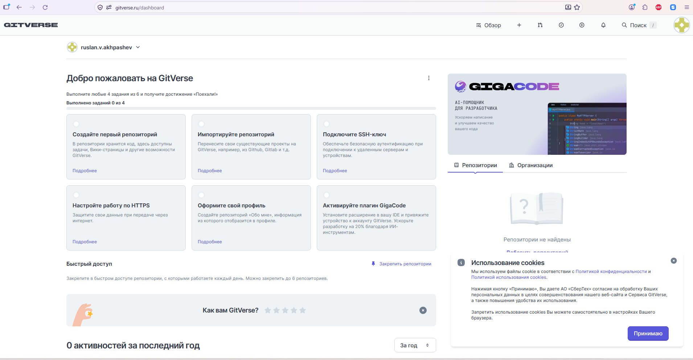

   Готово.

Создание публичного репозитория в Gitverse
---------------------

0) В самом Getverse довольно подробно расписано как создать свой репозиторий:

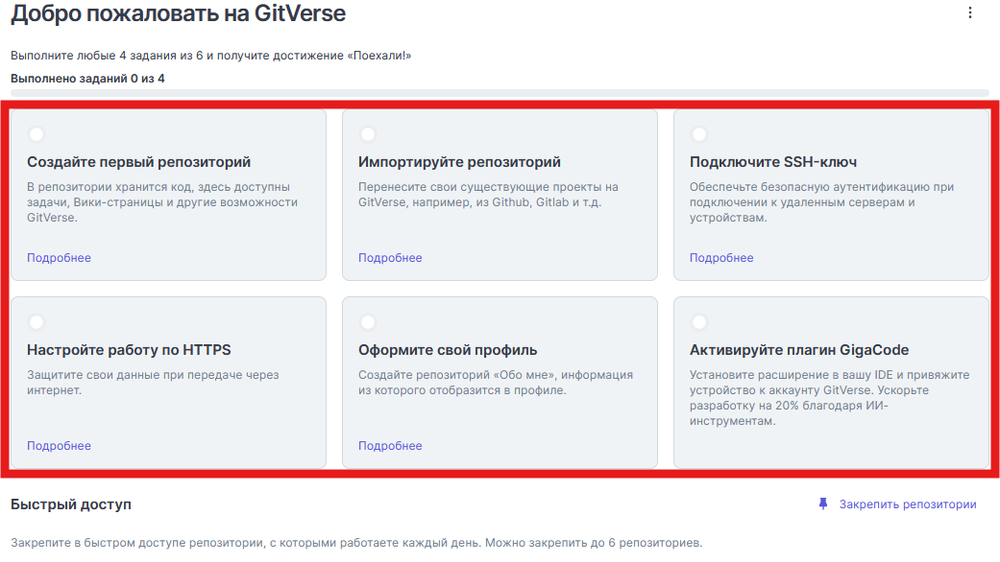

   Гайд от Gitverse.

**Либо. идем по каждому шагу отдельно**:

1) Нажимаем на кнопку **создания первого репозитория**:

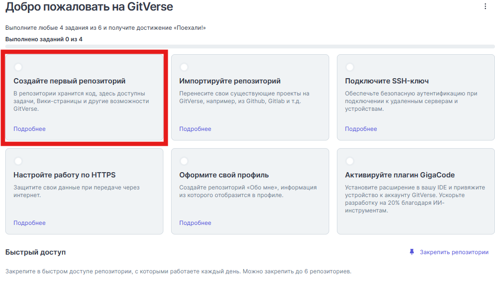

   Создать репозитрий.

2) Заполняем название Вашего репозитория, его видимость (пиватность) и т.д.:

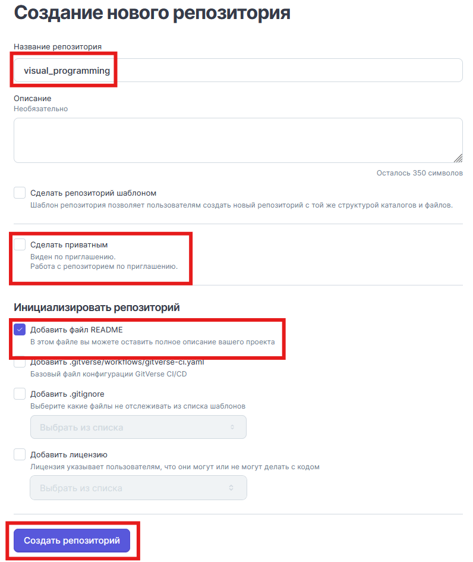

   Создание репозитория.

Файл ``README.md`` обычно представляет из себя обчыный текстовый файл, в котором описывают проект. Этот файл автоматически будет отображаться при переходе на Ваш проект.

3) Репозиторий успешно создан. Сейчас в нем присутствует лишь 1 файл: ``README.md``, его содержимое отображается как описание вашего проекта.

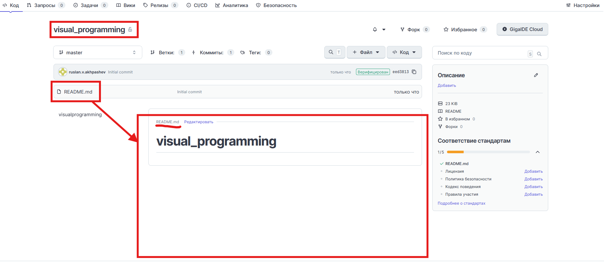

   Репозиторий создан.

